# j2hh full dossier

Generated: `2026-03-25T11:26:46Z`

Storage root: `/home/ecm5702/hpcperm/docs/exp/j2hh`

## What this is
This page is a durable, self-contained dossier for `j2hh` under `~/hpcperm/docs/exp/j2hh`. It collects the important outputs, repaired-job history, metadata, provenance links, and plot access points for the completed `j2hh` evaluation bundle.

> GitHub note:
> the inline images under `previews/` render normally on GitHub, but most files under `links/` are symlinks back to local ECMWF paths and are mainly for use on the source machine or in local Obsidian sessions.

## Experiment identity
- expver: `j2hh`
- stack: `old`
- checkpoint family: `56b6c4e2a6064878841dba0635c7be44`
- checkpoint dossier: [`56b6c4e2.md`](links/provenance/56b6c4e2.md)
- canonical completed task note: [`20260323_j2hh_prepml_full_august_quaver_eval.md`](links/provenance/20260323_j2hh_prepml_full_august_quaver_eval.md)
- durable checkpoint copy: [`20260325_j2hh_repairing_eval_checkpoint.md`](links/provenance/20260325_j2hh_repairing_eval_checkpoint.md)
- primary eval root: `/home/ecm5702/perm/eval/j2hh`
- spectra root: `/home/ecm5702/perm/ai_spectra/j2hh`
- status: `completed`

## Final status
- The repaired `j2hh` evaluation is complete.
- Final successful jobs:
  - `32735939` `qpsfc_j2hh`
  - `32735940` `qppl_j2hh`
  - `32736436` `regionplot_j2hh`
- Final verified core outputs:
  - [`predictions.nc`](links/data/predictions.nc)
  - [`all_regions_plots.pdf`](links/artifacts/all_regions_plots.pdf)
  - [`quaver_j2hh_sfc_crps_spread.pdf`](links/artifacts/quaver_j2hh_sfc_crps_spread.pdf)
  - [`quaver_j2hh_pl_crps_spread.pdf`](links/artifacts/quaver_j2hh_pl_crps_spread.pdf)
  - [`tc_normed_pdfs_all_events_j2hh.pdf`](links/artifacts/tc_normed_pdfs_all_events_j2hh.pdf)
  - the spectra PDFs listed below

## Main plot inventory
| plot family | file | size | pages | note |
| --- | --- | ---: | ---: | --- |
| Regional plots | [`all_regions_plots.pdf`](links/artifacts/all_regions_plots.pdf) | 34.2 MB | 16 | 16-page multi-region bundle from saved predictions.nc |
| Quaver surface CRPS/spread | [`quaver_j2hh_sfc_crps_spread.pdf`](links/artifacts/quaver_j2hh_sfc_crps_spread.pdf) | 33.0 KB | 6 | 6-page surface quaver CRPS/spread bundle |
| Quaver pressure-level CRPS/spread | [`quaver_j2hh_pl_crps_spread.pdf`](links/artifacts/quaver_j2hh_pl_crps_spread.pdf) | 95.3 KB | 24 | 24-page pressure-level quaver CRPS/spread bundle |
| TC all-events PDF | [`tc_normed_pdfs_all_events_j2hh.pdf`](links/artifacts/tc_normed_pdfs_all_events_j2hh.pdf) | 41.9 KB | 5 | 5-page TC distribution bundle |
| Spectra 2t | [`spectra_2t_sfc.pdf`](links/artifacts/spectra_2t_sfc.pdf) | 19.9 KB | 1 | single-page spectra plot |
| Spectra 10u | [`spectra_10u_sfc.pdf`](links/artifacts/spectra_10u_sfc.pdf) | 19.5 KB | 1 | single-page spectra plot |
| Spectra 10v | [`spectra_10v_sfc.pdf`](links/artifacts/spectra_10v_sfc.pdf) | 19.7 KB | 1 | single-page spectra plot |
| Spectra sp | [`spectra_sp_sfc.pdf`](links/artifacts/spectra_sp_sfc.pdf) | 19.4 KB | 1 | single-page spectra plot |
| Spectra t850 | [`spectra_t_850.pdf`](links/artifacts/spectra_t_850.pdf) | 20.0 KB | 1 | single-page spectra plot |
| Spectra z500 | [`spectra_z_500.pdf`](links/artifacts/spectra_z_500.pdf) | 18.3 KB | 1 | single-page spectra plot |

## Historical spectra compare bundle
| historical spectra compare | file | size | pages |
| --- | --- | ---: | ---: |
| `spectra_10u_sfc` | [`spectra_10u_sfc.pdf`](links/historical_compare/spectra_10u_sfc.pdf) | 20.5 KB | 1 |
| `spectra_10v_sfc` | [`spectra_10v_sfc.pdf`](links/historical_compare/spectra_10v_sfc.pdf) | 20.5 KB | 1 |
| `spectra_2t_sfc` | [`spectra_2t_sfc.pdf`](links/historical_compare/spectra_2t_sfc.pdf) | 20.5 KB | 1 |
| `spectra_sp_sfc` | [`spectra_sp_sfc.pdf`](links/historical_compare/spectra_sp_sfc.pdf) | 20.0 KB | 1 |
| `spectra_t_850` | [`spectra_t_850.pdf`](links/historical_compare/spectra_t_850.pdf) | 21.0 KB | 1 |
| `spectra_z_500` | [`spectra_z_500.pdf`](links/historical_compare/spectra_z_500.pdf) | 20.5 KB | 1 |

## Important data and reference artifacts
| data artifact | link | size | note |
| --- | --- | ---: | --- |
| `predictions.nc` | [`predictions.nc`](links/data/predictions.nc) | 1.1 GB | prediction dataset |
| `sample_manifest.json` | [`sample_manifest.json`](links/data/sample_manifest.json) | 1.9 KB | supporting JSON metadata |
| `tc_extreme_tail_idalia_j2hh.json` | [`tc_extreme_tail_idalia_j2hh.json`](links/data/tc_extreme_tail_idalia_j2hh.json) | 2.0 KB | supporting JSON metadata |
| `tc_normed_pdfs_all_events_j2hh.stats.json` | [`tc_normed_pdfs_all_events_j2hh.stats.json`](links/data/tc_normed_pdfs_all_events_j2hh.stats.json) | 94.1 KB | supporting JSON metadata |
| `eefo_reference_o96_j2hh_20230826_n1_2_s24_120.grib` | [`eefo_reference_o96_j2hh_20230826_n1_2_s24_120.grib`](links/reference_grib/eefo_reference_o96_j2hh_20230826_n1_2_s24_120.grib) | 6.2 MB | reference GRIB used for repaired one-date eval |
| `enfo_reference_o320_j2hh_20230826_n1_2_s24_120.grib` | [`enfo_reference_o320_j2hh_20230826_n1_2_s24_120.grib`](links/reference_grib/enfo_reference_o320_j2hh_20230826_n1_2_s24_120.grib) | 64.4 MB | reference GRIB used for repaired one-date eval |

## Prediction dataset metadata
### Dimensions
| key | value |
| --- | --- |
| `ensemble_member` | `2` |
| `forecast_reference_time` | `1` |
| `grid_point_hres` | `421120` |
| `weather_state` | `8` |
| `step` | `5` |
| `grid_point_lres` | `40320` |

### Global attributes
| key | value |
| --- | --- |
| `Conventions` | `CF-1.8` |
| `class` | `rd` |
| `date` | `20230826` |
| `domain` | `g` |
| `expver` | `j2hh` |
| `grid` | `O320` |
| `institution` | `ECMWF` |
| `stream` | `enfo` |
| `time` | `0` |
| `type` | `pf` |

### Data variables
`y_pred`, `y_pred_0`, `y_pred_1`, `y`, `y_0`, `y_1`, `x`, `x_0`, `x_1`

### Coordinates
`ensemble_member`, `forecast_reference_time`, `grid_point_hres`, `weather_state`, `step`, `lat_hres`, `lon_hres`, `grid_point_lres`, `lat_lres`, `lon_lres`

## Scoreboard sample manifest summary
- Manifest file: [`sample_manifest.json`](links/data/sample_manifest.json)
- Variables represented: `2t_sfc`, `10u_sfc`, `10v_sfc`, `t_850`, `z_500`
- Sample count per variable: `5`
- Sample pairs:
- `20230801 step144 member01`
- `20230801 step144 member02`
- `20230802 step144 member01`
- `20230802 step144 member02`
- `20230803 step144 member01`

## Tropical cyclone coverage
- Stats file: [`tc_normed_pdfs_all_events_j2hh.stats.json`](links/data/tc_normed_pdfs_all_events_j2hh.stats.json)
- Extreme-tail summary: [`tc_extreme_tail_idalia_j2hh.json`](links/data/tc_extreme_tail_idalia_j2hh.json)
- PDF bundle: [`tc_normed_pdfs_all_events_j2hh.pdf`](links/artifacts/tc_normed_pdfs_all_events_j2hh.pdf)
- Events covered: `dora`, `fernanda`, `franklin`, `hilary`, `idalia`
- Variable groups in per-event stats: `mslp_hpa`, `wind10m_ms`

### Idalia extreme-tail thresholds
- `mslp_hpa_range`: `[980.0, 990.0]`
- `wind_ms_gt`: `25.0`
- `reference_exp_for_repro_score`: `ENFO_O320_ip6y`

### Idalia extreme-tail score table
| exp | extreme_repro_score | extreme_score | mslp_980_990_fraction | wind_gt_25_fraction |
| --- | ---: | ---: | ---: | ---: |
| `ENFO_O320_ip6y` | 1.000 | 0.891 | 0.000522 | 0.000204 |
| `ENFO_O320_0001` | 0.908 | 0.860 | 0.000466 | 0.000221 |
| `OPER_O320_0001` | 0.813 | 0.906 | 0.000440 | 0.000260 |
| `ENFO_O320_j2hh` | 0.629 | 0.533 | 0.000355 | 0.000118 |
| `EEFO_O96_0001` | 0.086 | 0.000 | 0.000084 | 0.000002 |

## Recovery summary
- Initial failure state:
  - `32488436` and `32488437` failed with `python: command not found`.
  - `32488434` failed because the default reference GRIB path did not exist.
- Reference-data fix:
  - Created j2hh-specific reference GRIB files and switched the eval launcher to use them.
  - Patched [`manual_inference_data.py`](links/provenance/manual_inference_data.py) so single-date reference GRIBs missing an explicit `forecast_reference_time` dimension are normalized from GRIB metadata.
- Quaver fix:
  - Patched the quaver plot jobscripts to activate the `.ds-dyn` Python environment.
  - Replaced brittle line-number rewriting with content-based replacement logic in the plotting jobscripts.
- Region-plot fix:
  - Patched [`plot_regions.py`](links/provenance/plot_regions.py) to skip multi-member aggregate variables that still carry an `ensemble_member` dimension.
  - Moved final region plotting to [`region_plot_from_predictions_j2hh_20260324.sbatch`](links/provenance/region_plot_from_predictions_j2hh_20260324.sbatch) after the login-node attempt hit MEMKILL.

## Job history
| job id | name | outcome |
| --- | --- | --- |
| `32488434` | `eval_mars_j2hh` | failed initially: missing default reference GRIB |
| `32488436` | `qpsfc_j2hh` | failed initially: python not found |
| `32488437` | `qppl_j2hh` | failed initially: python not found |
| `32734577` | `eval_mars_j2hh` | rerun wrote predictions.nc; old region plotting path then failed |
| `32734580` | `qpsfc_j2hh` | rerun exposed stale line-number patching |
| `32734581` | `qppl_j2hh` | rerun exposed stale line-number patching |
| `32735939` | `qpsfc_j2hh` | completed |
| `32735940` | `qppl_j2hh` | completed |
| `32736436` | `regionplot_j2hh` | completed |

## Provenance and source files
| provenance file | link |
| --- | --- |
| `20260323_j2hh_prepml_full_august_quaver_eval.md` | [`20260323_j2hh_prepml_full_august_quaver_eval.md`](links/provenance/20260323_j2hh_prepml_full_august_quaver_eval.md) |
| `20260325_j2hh_repairing_eval_checkpoint.md` | [`20260325_j2hh_repairing_eval_checkpoint.md`](links/provenance/20260325_j2hh_repairing_eval_checkpoint.md) |
| `56b6c4e2.md` | [`56b6c4e2.md`](links/provenance/56b6c4e2.md) |
| `eval_mars_j2hh_20260323.sbatch` | [`eval_mars_j2hh_20260323.sbatch`](links/provenance/eval_mars_j2hh_20260323.sbatch) |
| `quaver_plot_sfc_j2hh_crps_spread_20260323.sbatch` | [`quaver_plot_sfc_j2hh_crps_spread_20260323.sbatch`](links/provenance/quaver_plot_sfc_j2hh_crps_spread_20260323.sbatch) |
| `quaver_plot_pl_j2hh_crps_spread_20260323.sbatch` | [`quaver_plot_pl_j2hh_crps_spread_20260323.sbatch`](links/provenance/quaver_plot_pl_j2hh_crps_spread_20260323.sbatch) |
| `region_plot_from_predictions_j2hh_20260324.sbatch` | [`region_plot_from_predictions_j2hh_20260324.sbatch`](links/provenance/region_plot_from_predictions_j2hh_20260324.sbatch) |
| `manual_inference_data.py` | [`manual_inference_data.py`](links/provenance/manual_inference_data.py) |
| `plot_regions.py` | [`plot_regions.py`](links/provenance/plot_regions.py) |

## Logs
| file | link | size | note |
| --- | --- | ---: | --- |
| `eval_mars_j2hh_32734577.out` | [`eval_mars_j2hh_32734577.out`](links/logs/eval_mars_j2hh_32734577.out) | 17.3 KB | log/provenance |
| `quaver_sfc_j2hh_32735939.out` | [`quaver_sfc_j2hh_32735939.out`](links/logs/quaver_sfc_j2hh_32735939.out) | 57.1 KB | log/provenance |
| `quaver_pl_j2hh_32735940.out` | [`quaver_pl_j2hh_32735940.out`](links/logs/quaver_pl_j2hh_32735940.out) | 467.6 KB | log/provenance |
| `region_plot_j2hh_32736436.out` | [`region_plot_j2hh_32736436.out`](links/logs/region_plot_j2hh_32736436.out) | 6.3 KB | log/provenance |
| `reference_grib_build_20260324.log` | [`reference_grib_build_20260324.log`](links/logs/reference_grib_build_20260324.log) | 39.5 KB | log/provenance |
| `reference_grib_build_20260324_twodate.log` | [`reference_grib_build_20260324_twodate.log`](links/logs/reference_grib_build_20260324_twodate.log) | 20.8 KB | log/provenance |

## Preview note
Multi-page bundles are previewed here on a representative first page (or all pages only when the bundle is short) so the dossier stays usable. Follow the linked PDFs above for the full plot set.

## Regional plots preview
[Open full PDF](links/artifacts/all_regions_plots.pdf)
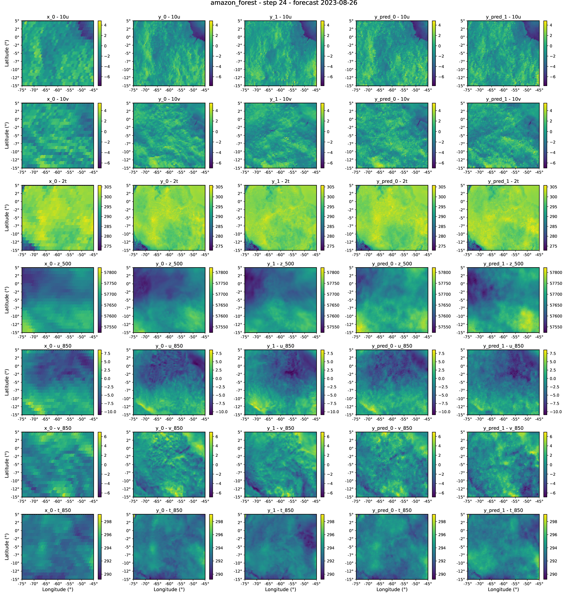

## Quaver previews
### Surface CRPS/spread
[Open full PDF](links/artifacts/quaver_j2hh_sfc_crps_spread.pdf)
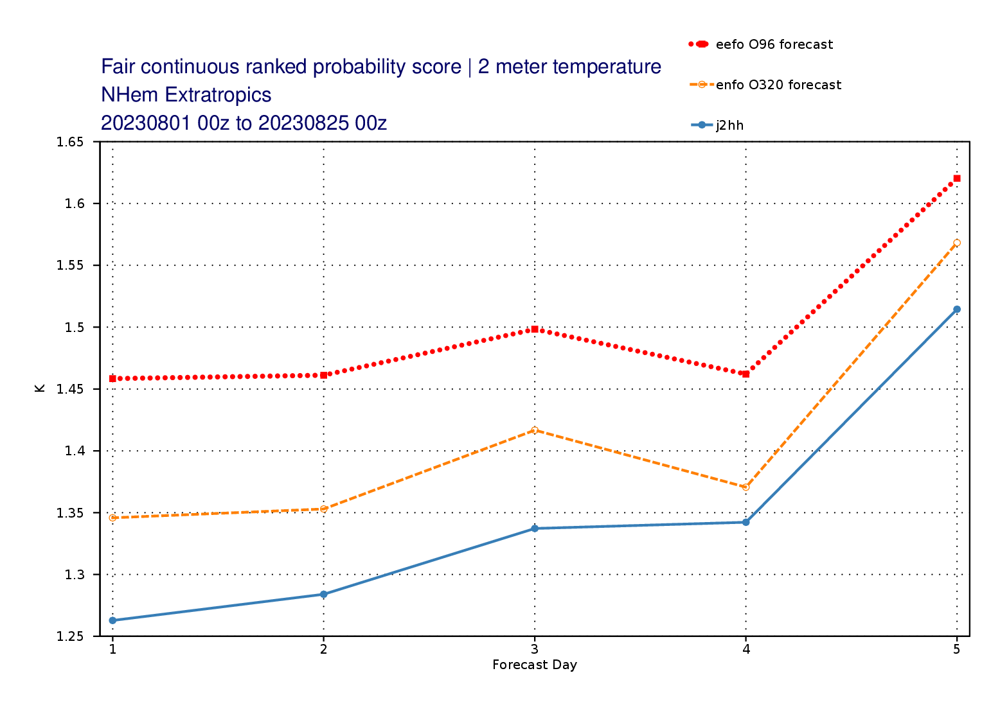

### Pressure-level CRPS/spread
[Open full PDF](links/artifacts/quaver_j2hh_pl_crps_spread.pdf)
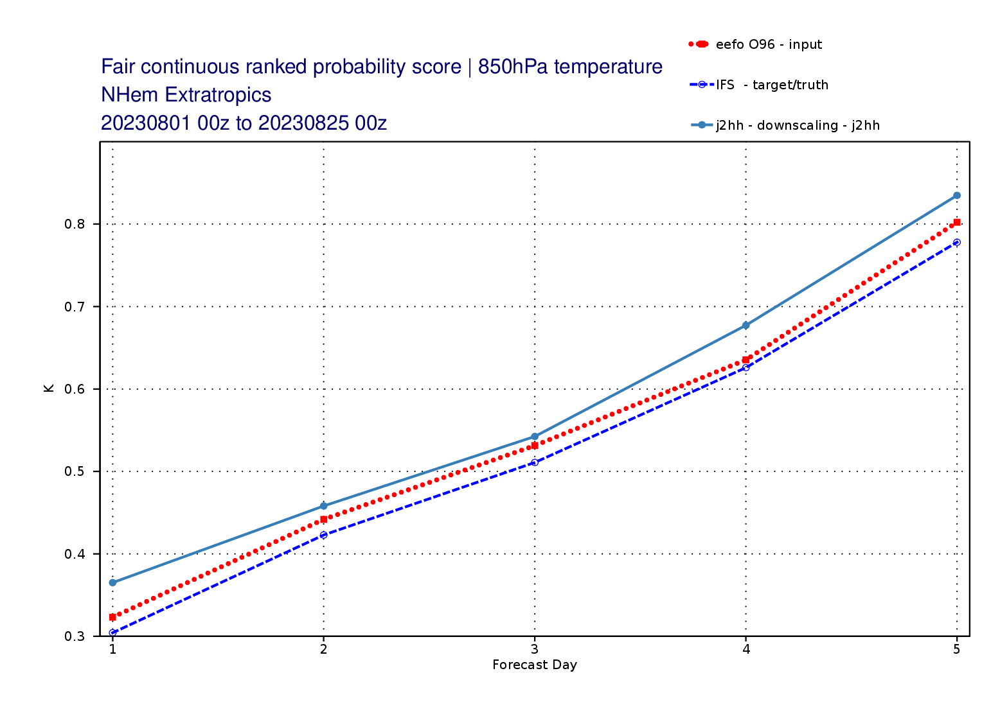

## Spectra previews
### spectra_2t_sfc
[Open PDF](links/artifacts/spectra_2t_sfc.pdf)
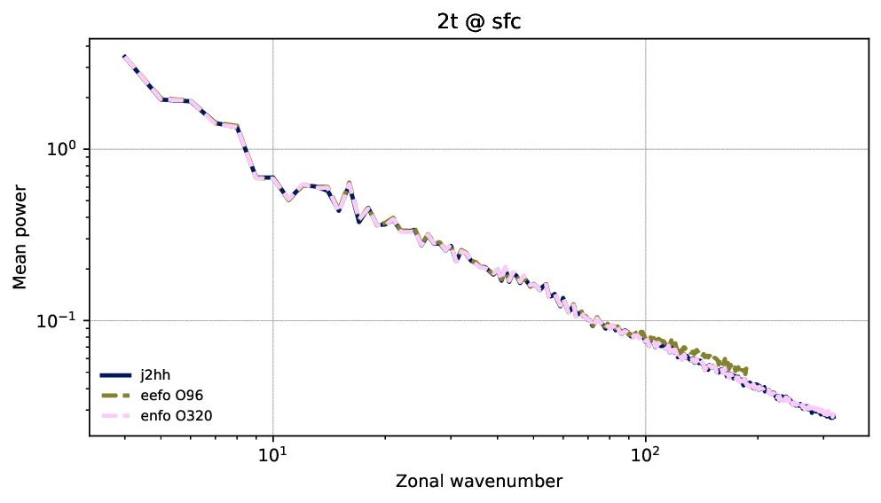

### spectra_10u_sfc
[Open PDF](links/artifacts/spectra_10u_sfc.pdf)
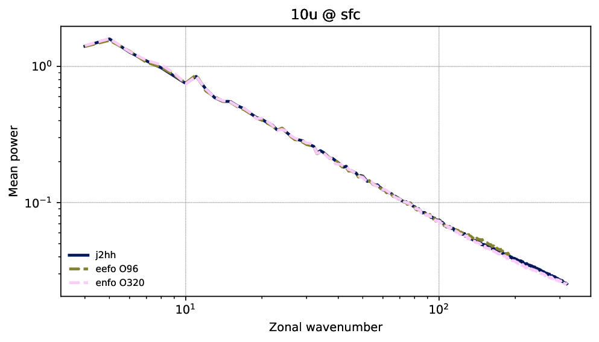

### spectra_10v_sfc
[Open PDF](links/artifacts/spectra_10v_sfc.pdf)
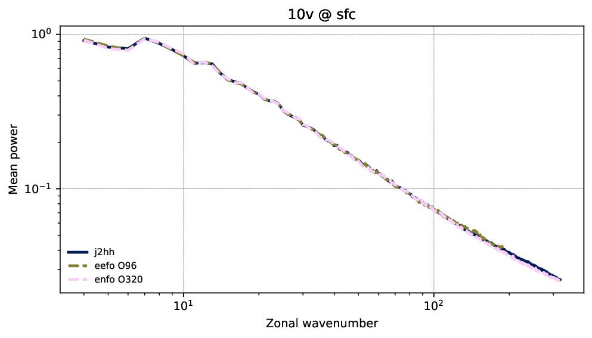

### spectra_sp_sfc
[Open PDF](links/artifacts/spectra_sp_sfc.pdf)
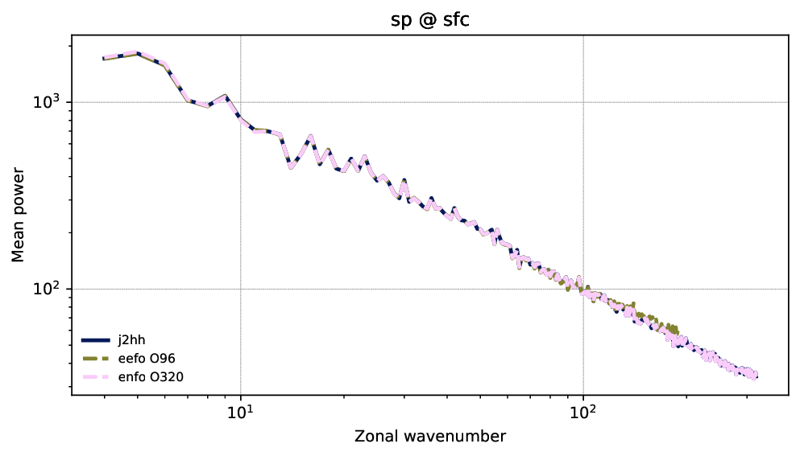

### spectra_t_850
[Open PDF](links/artifacts/spectra_t_850.pdf)
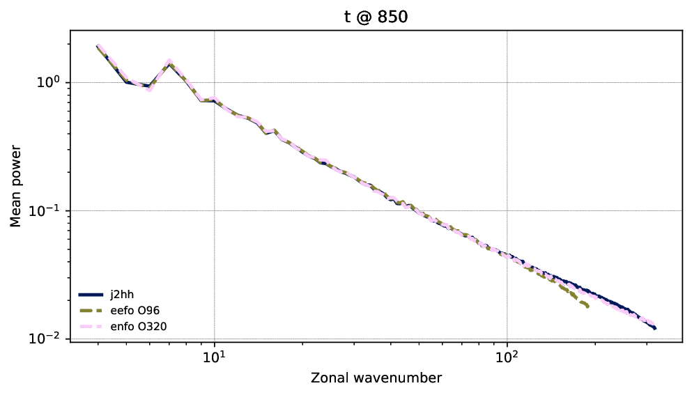

### spectra_z_500
[Open PDF](links/artifacts/spectra_z_500.pdf)
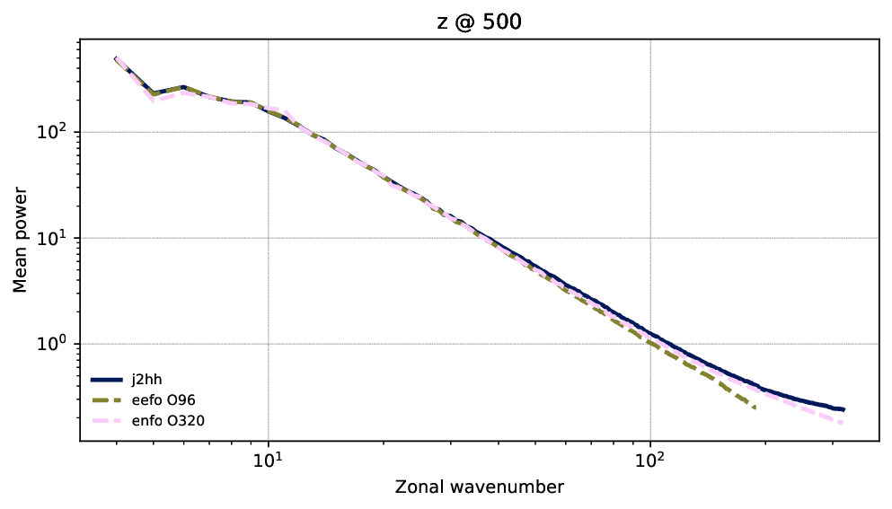

## TC all-events PDF previews
[Open full PDF](links/artifacts/tc_normed_pdfs_all_events_j2hh.pdf)
### Page 1
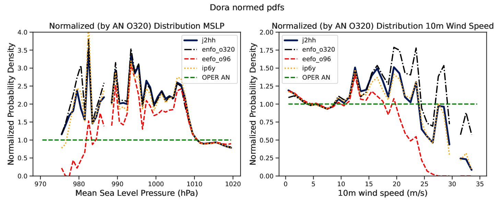

### Page 2
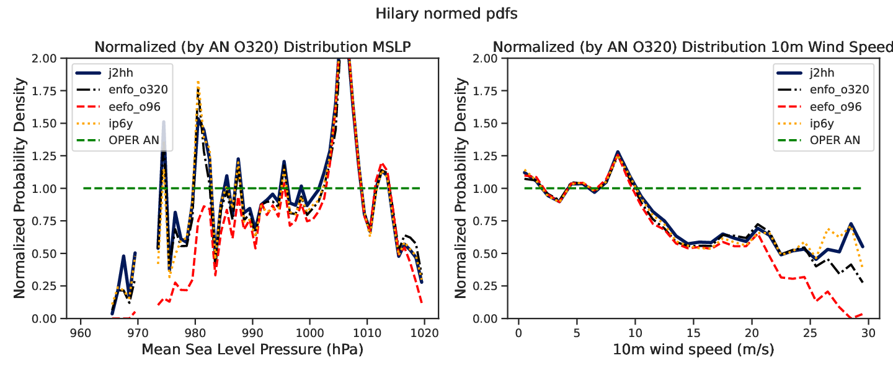

### Page 3
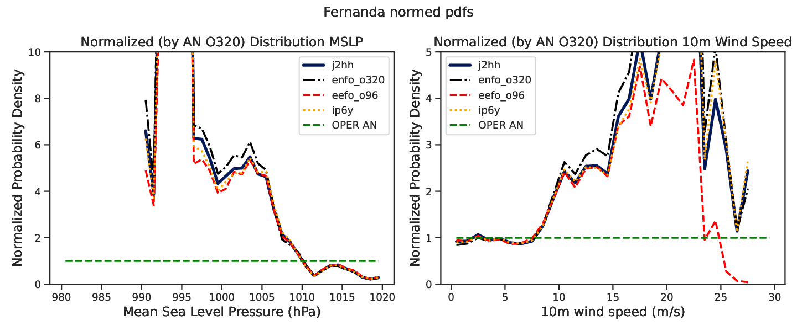

### Page 4
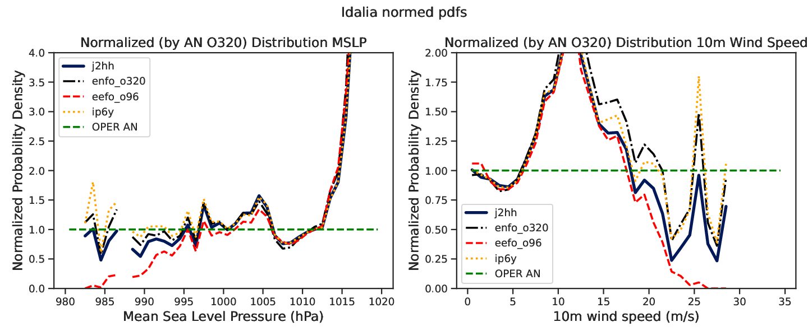

### Page 5
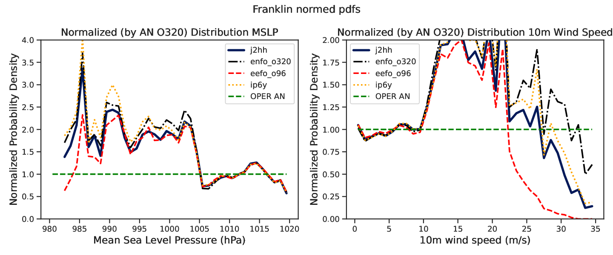

## TC member PNG gallery
### dora
- [`dora_msl_fields_6_08_step1.png`](links/tc_members/dora_msl_fields_6_08_step1.png)
  
- [`dora_wind10m_fields_6_08_step1.png`](links/tc_members/dora_wind10m_fields_6_08_step1.png)
  

### fernanda
- [`fernanda_msl_fields_13_08_step2.png`](links/tc_members/fernanda_msl_fields_13_08_step2.png)
  
- [`fernanda_wind10m_fields_13_08_step2.png`](links/tc_members/fernanda_wind10m_fields_13_08_step2.png)
  

### franklin
- [`franklin_msl_fields_28_08_step1.png`](links/tc_members/franklin_msl_fields_28_08_step1.png)
  
- [`franklin_wind10m_fields_28_08_step1.png`](links/tc_members/franklin_wind10m_fields_28_08_step1.png)
  

### hilary
- [`hilary_msl_fields_17_08_step1.png`](links/tc_members/hilary_msl_fields_17_08_step1.png)
  
- [`hilary_wind10m_fields_17_08_step1.png`](links/tc_members/hilary_wind10m_fields_17_08_step1.png)
  

### idalia
- [`idalia_msl_fields_28_08_step1.png`](links/tc_members/idalia_msl_fields_28_08_step1.png)
  
- [`idalia_wind10m_fields_28_08_step1.png`](links/tc_members/idalia_wind10m_fields_28_08_step1.png)
  
