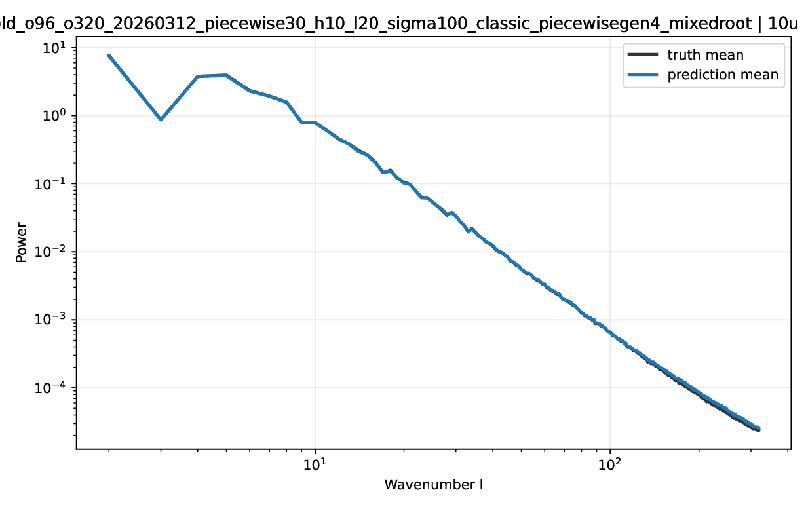
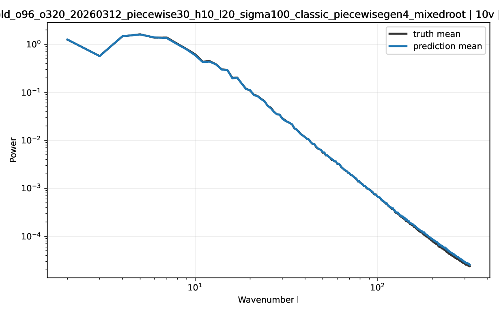
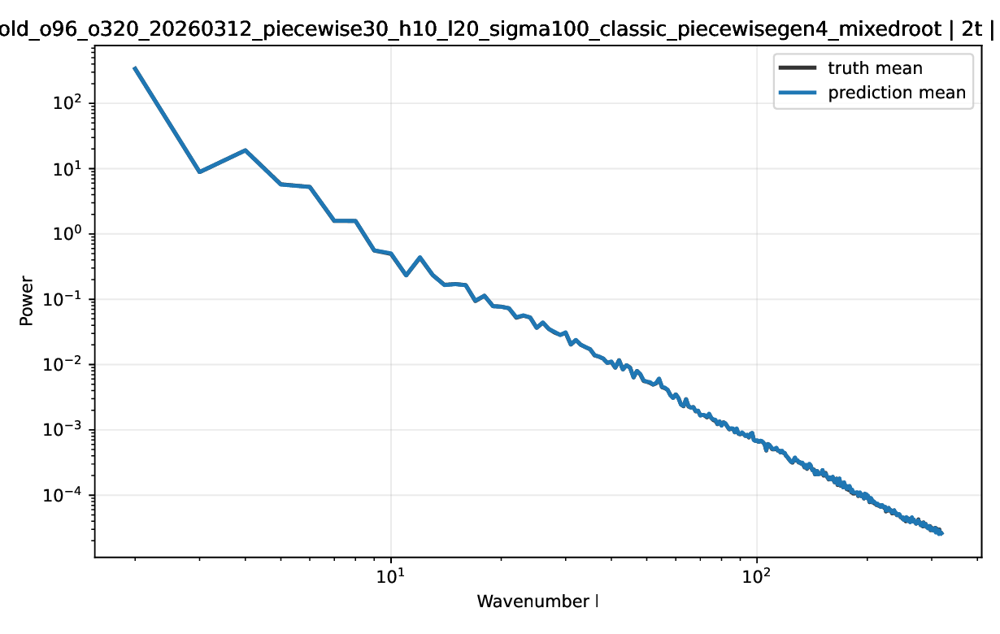
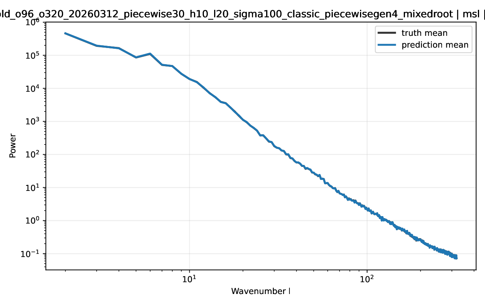
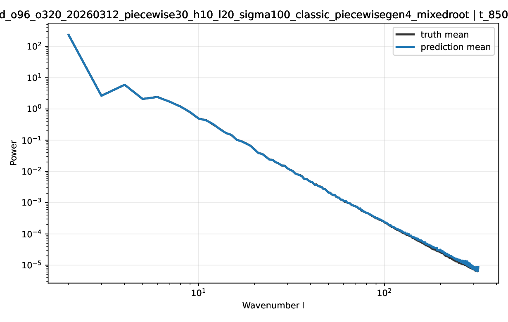
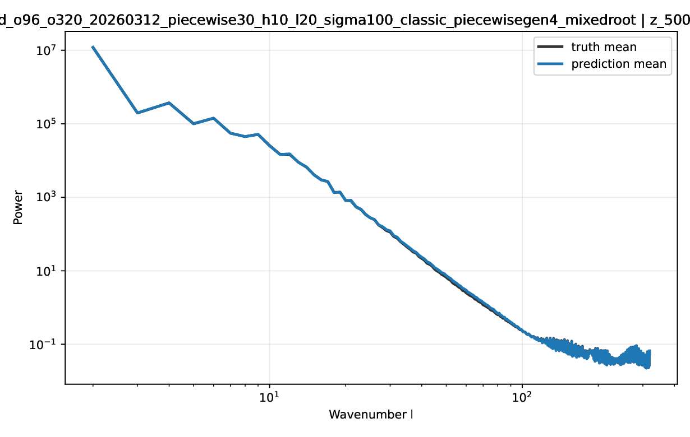
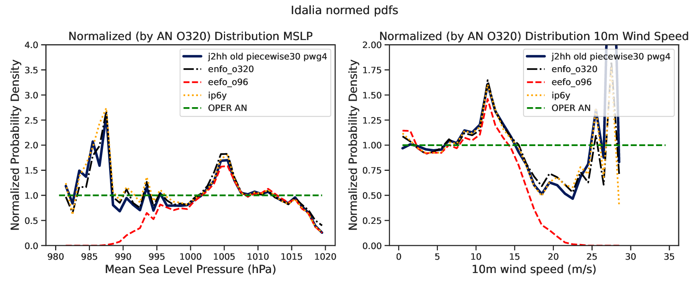
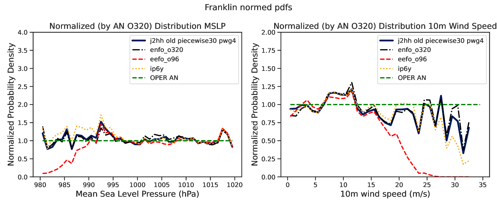
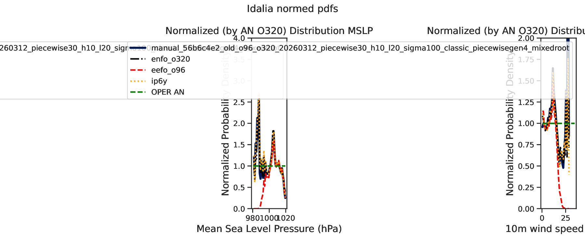
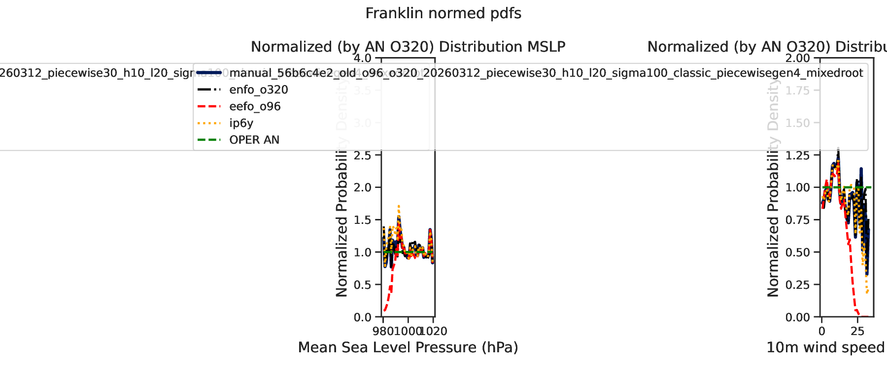

# 56b6 old pw30 classic

Generated: `2026-04-23T14:03:18Z`

Storage root: `/home/ecm5702/hpcperm/docs/exp/manual-56b6c4e2-old-piecewise30-h10-l20-sigma100`

## What this is
This room mirrors the current scoreboard-facing manual-inference artifacts into an Obsidian-friendly page with inline previews plus lightweight copied configs, stats, logs, and selected artifacts inside the vault.

> GitHub note:
> the inline PNG previews render directly here; lightweight files are copied into the vault, while bulky data such as `predictions/` and plot directories remain linked so the vault stays git-light.

## Experiment identity
- slug: `manual-56b6c4e2-old-piecewise30-h10-l20-sigma100`
- checkpoint id: `56b6c4e2a6064878841dba0635c7be44`
- checkpoint path: `/home/ecm5702/scratch/aifs/checkpoint/56b6c4e2a6064878841dba0635c7be44/last.ckpt`
- stack: `old`
- run id: `manual_56b6c4e2_old_o96_o320_20260312_piecewise30_h10_l20_sigma100_classic_piecewisegen4_mixedroot`
- run root: `/home/ecm5702/perm/eval/manual_56b6c4e2_old_o96_o320_20260312_piecewise30_h10_l20_sigma100_classic_piecewisegen4_mixedroot`
- venv: `/home/ecm5702/dev/.ds-old/bin/activate`
- login node: `na`
- qos: `na`
- job ids: `na`
- sampling summary: `schedule_type=experimental_piecewise, schedule_kind=piecewise30, high_schedule_type=exponential, low_schedule_type=karras, num_steps=30, num_steps_high=10, num_steps_low=20, sigma_min=0.03, sigma_transition=100.0, sigma_max=100000.0, rho=7.0, sampler=heun, S_churn=2.5, S_min=0.75, S_max=100000.0, S_noise=1.05`
- consolidated source dossier: [`manual-56b6c4e2-old-piecewise30-h10-l20-sigma100.md`](links/provenance/manual-56b6c4e2-old-piecewise30-h10-l20-sigma100.md)

## Current scoreboard status
| surface | rank | contract | idalia tc | franklin tc | spectra mean | surface mse | val loss | note |
| --- | ---: | --- | ---: | ---: | ---: | ---: | ---: | --- |
| Aug 26-30 | 1 | `eligible` | 0.977885 | 0.966184 | 0.968647 | 10783.899057 | na | Full-contract row with TC plus spectra complete. |
| Proxy10 | 4 | `eligible` | 0.970960 | 0.965815 | 0.961558 | 10783.899057 | na | Corrected proxy10total row with scoreboard-native TC and spectra artifacts. |

## Coverage summary
- predictions files: `25`
- local-plot directories: `2`
- spectra directories: `6`
- top-level PDFs/PNGs: `4`
- top-level JSON/TXT/CSV/YAML files: `7`
- logs: `3`
- extra directories: `7`

## Publication notes
- the bulky `predictions/` directory remains linked rather than copied into the vault
- files larger than `20 MB` stay linked so the vault remains lightweight

## Key data files
| file | link | size |
| --- | --- | ---: |
| `EXPERIMENT_CONFIG.yaml` | [`EXPERIMENT_CONFIG.yaml`](links/data/EXPERIMENT_CONFIG.yaml) | 10.8 KB |
| `manual_inference_run_info.txt` | [`manual_inference_run_info.txt`](links/data/manual_inference_run_info.txt) | 1.4 KB |
| `predictions_manifest.csv` | [`predictions_manifest.csv`](links/data/predictions_manifest.csv) | 79.2 KB |
| `surface_loss_summary.json` | [`surface_loss_summary.json`](links/data/surface_loss_summary.json) | 1.4 KB |
| `tc_normed_pdfs_franklin_manual_56b6c4e2_old_o96_o320_20260312_piecewise30_h10_l20_sigma100_classic_piecewisegen4_mixedroot_from_predictions.stats.json` | [`tc_normed_pdfs_franklin_manual_56b6c4e2_old_o96_o320_20260312_piecewise30_h10_l20_sigma100_classic_piecewisegen4_mixedroot_from_predictions.stats.json`](links/data/tc_normed_pdfs_franklin_manual_56b6c4e2_old_o96_o320_20260312_piecewise30_h10_l20_sigma100_classic_piecewisegen4_mixedroot_from_predictions.stats.json) | 23.5 KB |
| `tc_normed_pdfs_idalia_franklin_56b6c4e2_full25_strict_20260317.stats.json` | [`tc_normed_pdfs_idalia_franklin_56b6c4e2_full25_strict_20260317.stats.json`](links/data/tc_normed_pdfs_idalia_franklin_56b6c4e2_full25_strict_20260317.stats.json) | 43.8 KB |
| `tc_normed_pdfs_idalia_manual_56b6c4e2_old_o96_o320_20260312_piecewise30_h10_l20_sigma100_classic_piecewisegen4_mixedroot_from_predictions.stats.json` | [`tc_normed_pdfs_idalia_manual_56b6c4e2_old_o96_o320_20260312_piecewise30_h10_l20_sigma100_classic_piecewisegen4_mixedroot_from_predictions.stats.json`](links/data/tc_normed_pdfs_idalia_manual_56b6c4e2_old_o96_o320_20260312_piecewise30_h10_l20_sigma100_classic_piecewisegen4_mixedroot_from_predictions.stats.json) | 23.2 KB |
| `predictions/` | [`predictions/`](links/data/predictions) | 25 files |

## Key top-level artifacts
| file | link | size |
| --- | --- | ---: |
| `tc_normed_pdfs_all_events_manual_56b6c4e2_old_o96_o320_20260312_piecewise30_h10_l20_sigma100_classic_piecewisegen4_mixedroot.pdf` | [`tc_normed_pdfs_all_events_manual_56b6c4e2_old_o96_o320_20260312_piecewise30_h10_l20_sigma100_classic_piecewisegen4_mixedroot.pdf`](links/artifacts/tc_normed_pdfs_all_events_manual_56b6c4e2_old_o96_o320_20260312_piecewise30_h10_l20_sigma100_classic_piecewisegen4_mixedroot.pdf) | 21.5 KB |
| `tc_normed_pdfs_franklin_manual_56b6c4e2_old_o96_o320_20260312_piecewise30_h10_l20_sigma100_classic_piecewisegen4_mixedroot_from_predictions.pdf` | [`tc_normed_pdfs_franklin_manual_56b6c4e2_old_o96_o320_20260312_piecewise30_h10_l20_sigma100_classic_piecewisegen4_mixedroot_from_predictions.pdf`](links/artifacts/tc_normed_pdfs_franklin_manual_56b6c4e2_old_o96_o320_20260312_piecewise30_h10_l20_sigma100_classic_piecewisegen4_mixedroot_from_predictions.pdf) | 21.9 KB |
| `tc_normed_pdfs_idalia_franklin_56b6c4e2_full25_strict_20260317.pdf` | [`tc_normed_pdfs_idalia_franklin_56b6c4e2_full25_strict_20260317.pdf`](links/artifacts/tc_normed_pdfs_idalia_franklin_56b6c4e2_full25_strict_20260317.pdf) | 26.4 KB |
| `tc_normed_pdfs_idalia_manual_56b6c4e2_old_o96_o320_20260312_piecewise30_h10_l20_sigma100_classic_piecewisegen4_mixedroot_from_predictions.pdf` | [`tc_normed_pdfs_idalia_manual_56b6c4e2_old_o96_o320_20260312_piecewise30_h10_l20_sigma100_classic_piecewisegen4_mixedroot_from_predictions.pdf`](links/artifacts/tc_normed_pdfs_idalia_manual_56b6c4e2_old_o96_o320_20260312_piecewise30_h10_l20_sigma100_classic_piecewisegen4_mixedroot_from_predictions.pdf) | 21.5 KB |

## Spectra directories
| directory | link | PNGs | PDFs |
| --- | --- | ---: | ---: |
| `spectra` | [`spectra`](links/spectra/spectra) | 0 | 6 |
| `spectra_canonical_20260317` | [`spectra_canonical_20260317`](links/spectra/spectra_canonical_20260317) | 0 | 0 |
| `spectra_ecmwf` | [`spectra_ecmwf`](links/spectra/spectra_ecmwf) | 0 | 0 |
| `spectra_ecmwf_proxy10` | [`spectra_ecmwf_proxy10`](links/spectra/spectra_ecmwf_proxy10) | 0 | 0 |
| `spectra_harmonized_proxy10_20260318` | [`spectra_harmonized_proxy10_20260318`](links/spectra/spectra_harmonized_proxy10_20260318) | 0 | 6 |
| `spectra_harmonized_proxy10total_20260318` | [`spectra_harmonized_proxy10total_20260318`](links/spectra/spectra_harmonized_proxy10total_20260318) | 0 | 6 |

## Local-plot directories
| directory | link | PNGs | PDFs |
| --- | --- | ---: | ---: |
| `eval_one_date` | [`eval_one_date`](links/local_plots/eval_one_date) | 0 | 5 |
| `eval_one_date_amazon_member01` | [`eval_one_date_amazon_member01`](links/local_plots/eval_one_date_amazon_member01) | 5 | 5 |

## Logs
| file | link | size |
| --- | --- | ---: |
| `tc_cache_j2hh_38354672.out` | [`tc_cache_j2hh_38354672.out`](links/logs/tc_cache_j2hh_38354672.out) | 2.9 KB |
| `tc_cache_root_38363753.out` | [`tc_cache_root_38363753.out`](links/logs/tc_cache_root_38363753.out) | 3.3 KB |
| `tc_cache_smoke_38352387.out` | [`tc_cache_smoke_38352387.out`](links/logs/tc_cache_smoke_38352387.out) | 2.6 KB |

## Provenance
| file | link | size |
| --- | --- | ---: |
| `manual-56b6c4e2-old-piecewise30-h10-l20-sigma100.md` | [`manual-56b6c4e2-old-piecewise30-h10-l20-sigma100.md`](links/provenance/manual-56b6c4e2-old-piecewise30-h10-l20-sigma100.md) | 13.8 KB |
| `manual-56b6c4e2-old-piecewise30-h10-l20-sigma100.md` | [`manual-56b6c4e2-old-piecewise30-h10-l20-sigma100.md`](links/provenance/manual-56b6c4e2-old-piecewise30-h10-l20-sigma100.md) | 5.2 KB |
| `manual-56b6c4e2-old-piecewise30-h10-l20-sigma100.md` | [`manual-56b6c4e2-old-piecewise30-h10-l20-sigma100.md`](links/provenance/manual-56b6c4e2-old-piecewise30-h10-l20-sigma100.md) | 5.3 KB |
| `56b6c4e2.md` | [`56b6c4e2.md`](links/provenance/56b6c4e2.md) | 3.4 KB |

## Extra directories
| file | link | size |
| --- | --- | ---: |
| `eventscore_20260317/` | [`eventscore_20260317/`](links/extra/eventscore_20260317) | directory |
| `proxy10_subset_20260317/` | [`proxy10_subset_20260317/`](links/extra/proxy10_subset_20260317) | directory |
| `proxy10total_subset_20260318/` | [`proxy10total_subset_20260318/`](links/extra/proxy10total_subset_20260318) | directory |
| `scheduler_comparison_20260313/` | [`scheduler_comparison_20260313/`](links/extra/scheduler_comparison_20260313) | directory |
| `tc_cached_refs_j2hh_smoketest_20260313/` | [`tc_cached_refs_j2hh_smoketest_20260313/`](links/extra/tc_cached_refs_j2hh_smoketest_20260313) | directory |
| `tc_cached_refs_runroot_smoketest_20260313/` | [`tc_cached_refs_runroot_smoketest_20260313/`](links/extra/tc_cached_refs_runroot_smoketest_20260313) | directory |
| `tc_cached_refs_smoketest_20260313/` | [`tc_cached_refs_smoketest_20260313/`](links/extra/tc_cached_refs_smoketest_20260313) | directory |

## Local plot gallery
### `predictions_20230826_step024` / `amazon_forest_central_member01_classic.png`

### `predictions_20230826_step048` / `amazon_forest_central_member01_classic.png`

### `predictions_20230826_step072` / `amazon_forest_central_member01_classic.png`

### `predictions_20230826_step096` / `amazon_forest_central_member01_classic.png`

### `predictions_20230826_step120` / `amazon_forest_central_member01_classic.png`

## Spectra previews
### `spectra_10u.pdf`
[`spectra_10u.pdf`](links/spectra/spectra/spectra_10u.pdf)

### `spectra_10v.pdf`
[`spectra_10v.pdf`](links/spectra/spectra/spectra_10v.pdf)

### `spectra_2t.pdf`
[`spectra_2t.pdf`](links/spectra/spectra/spectra_2t.pdf)

### `spectra_msl.pdf`
[`spectra_msl.pdf`](links/spectra/spectra/spectra_msl.pdf)

### `spectra_t_850.pdf`
[`spectra_t_850.pdf`](links/spectra/spectra/spectra_t_850.pdf)

### `spectra_z_500.pdf`
[`spectra_z_500.pdf`](links/spectra/spectra/spectra_z_500.pdf)

## TC PDF previews
### `tc_normed_pdfs_all_events_manual_56b6c4e2_old_o96_o320_20260312_piecewise30_h10_l20_sigma100_classic_piecewisegen4_mixedroot.pdf`
[`tc_normed_pdfs_all_events_manual_56b6c4e2_old_o96_o320_20260312_piecewise30_h10_l20_sigma100_classic_piecewisegen4_mixedroot.pdf`](links/artifacts/tc_normed_pdfs_all_events_manual_56b6c4e2_old_o96_o320_20260312_piecewise30_h10_l20_sigma100_classic_piecewisegen4_mixedroot.pdf)

### `tc_normed_pdfs_franklin_manual_56b6c4e2_old_o96_o320_20260312_piecewise30_h10_l20_sigma100_classic_piecewisegen4_mixedroot_from_predictions.pdf`
[`tc_normed_pdfs_franklin_manual_56b6c4e2_old_o96_o320_20260312_piecewise30_h10_l20_sigma100_classic_piecewisegen4_mixedroot_from_predictions.pdf`](links/artifacts/tc_normed_pdfs_franklin_manual_56b6c4e2_old_o96_o320_20260312_piecewise30_h10_l20_sigma100_classic_piecewisegen4_mixedroot_from_predictions.pdf)

### `tc_normed_pdfs_idalia_franklin_56b6c4e2_full25_strict_20260317.pdf`
[`tc_normed_pdfs_idalia_franklin_56b6c4e2_full25_strict_20260317.pdf`](links/artifacts/tc_normed_pdfs_idalia_franklin_56b6c4e2_full25_strict_20260317.pdf)

### `tc_normed_pdfs_idalia_manual_56b6c4e2_old_o96_o320_20260312_piecewise30_h10_l20_sigma100_classic_piecewisegen4_mixedroot_from_predictions.pdf`
[`tc_normed_pdfs_idalia_manual_56b6c4e2_old_o96_o320_20260312_piecewise30_h10_l20_sigma100_classic_piecewisegen4_mixedroot_from_predictions.pdf`](links/artifacts/tc_normed_pdfs_idalia_manual_56b6c4e2_old_o96_o320_20260312_piecewise30_h10_l20_sigma100_classic_piecewisegen4_mixedroot_from_predictions.pdf)

## TC member gallery
### `dora_msl_fields_6_08_step1`

### `dora_wind10m_fields_6_08_step1`

### `fernanda_msl_fields_13_08_step2`

### `fernanda_wind10m_fields_13_08_step2`

### `franklin_msl_fields_28_08_step1`

### `franklin_wind10m_fields_28_08_step1`

### `hilary_msl_fields_17_08_step1`

### `hilary_wind10m_fields_17_08_step1`

### `idalia_msl_fields_28_08_step1`

### `idalia_wind10m_fields_28_08_step1`

