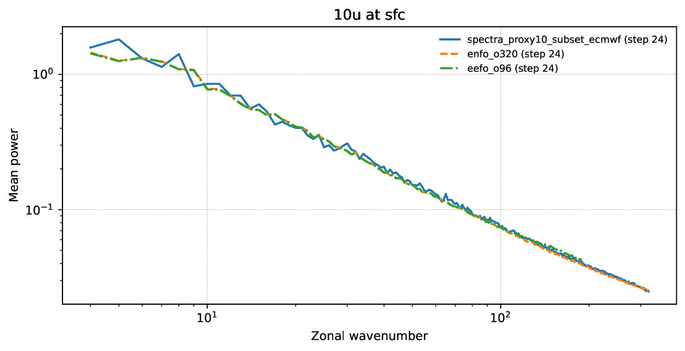
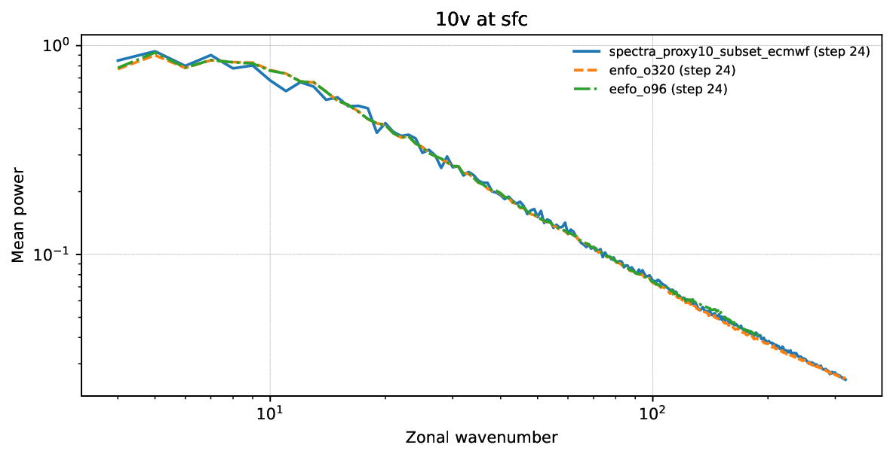
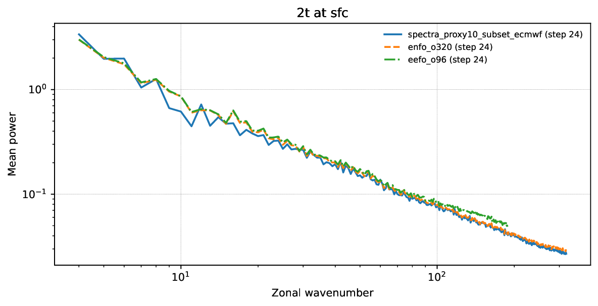
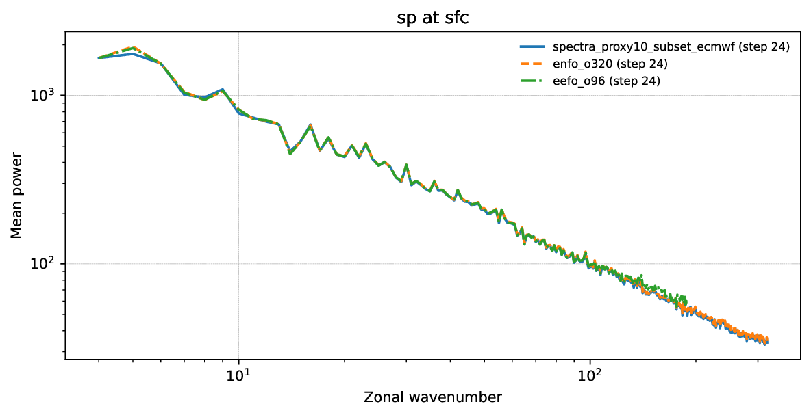
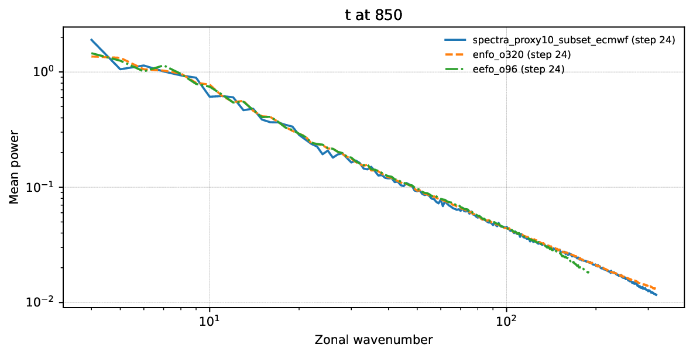
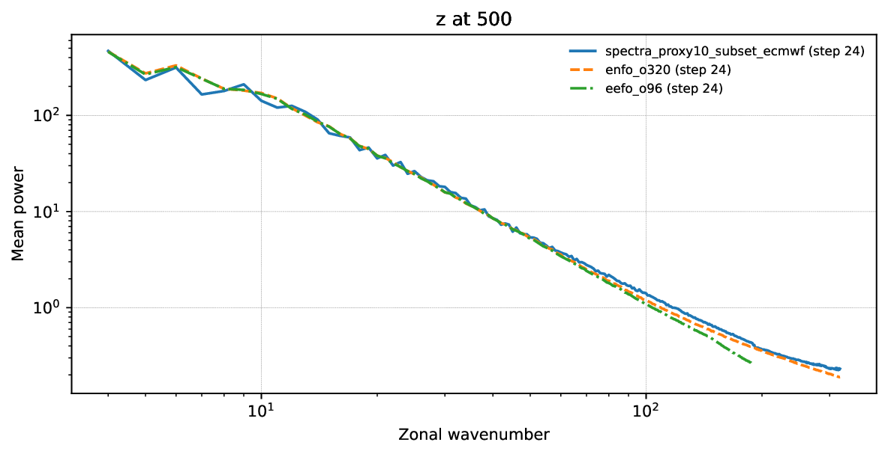
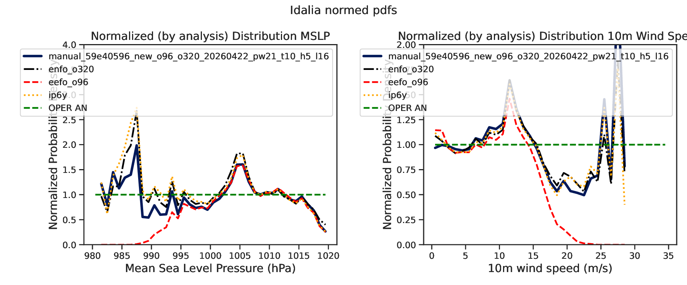
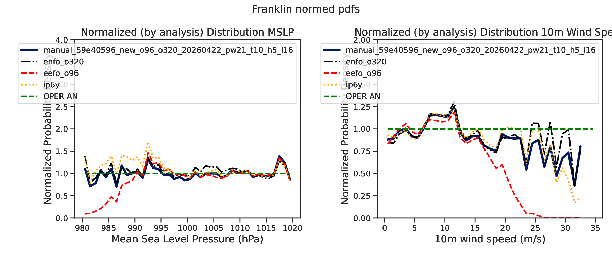

# 59e4 300k pw21 t10/h5/l16

Generated: `2026-04-23T14:03:32Z`

Storage root: `/home/ecm5702/hpcperm/docs/exp/manual-59e40596-new-piecewise21-t10-h5-l16`

## What this is
This room mirrors the current scoreboard-facing manual-inference artifacts into an Obsidian-friendly page with inline previews plus lightweight copied configs, stats, logs, and selected artifacts inside the vault.

> GitHub note:
> the inline PNG previews render directly here; lightweight files are copied into the vault, while bulky data such as `predictions/` and plot directories remain linked so the vault stays git-light.

## Experiment identity
- slug: `manual-59e40596-new-piecewise21-t10-h5-l16`
- checkpoint id: `59e40596023d4f72a1c5e2027805d7df`
- checkpoint path: `/home/ecm5702/scratch/aifs/checkpoint/59e40596023d4f72a1c5e2027805d7df/anemoi-by_epoch-epoch_260-step_300000.ckpt`
- stack: `new`
- run id: `manual_59e40596_new_o96_o320_20260422_pw21_t10_h5_l16`
- run root: `/home/ecm5702/perm/eval/manual_59e40596_new_o96_o320_20260422_pw21_t10_h5_l16`
- venv: `/home/ecm5702/dev/.ds-dyn/bin/activate`
- login node: `ac6-100`
- qos: `nf`
- job ids: `na`
- sampling summary: `na`
- consolidated source dossier: [`manual-59e40596-new-piecewise21-t10-h5-l16.md`](links/provenance/manual-59e40596-new-piecewise21-t10-h5-l16.md)

## Current scoreboard status
| surface | rank | contract | idalia tc | franklin tc | spectra mean | surface mse | val loss | note |
| --- | ---: | --- | ---: | ---: | ---: | ---: | ---: | --- |
| Aug 26-30 | 13 | `eligible` | 0.963081 | 0.964164 | 0.966629 | 10587.422618 | 0.060484 | Sweep finalist; σ_max=1000; infer 2:32:53. |
| Proxy10 | na | `na` | na | na | na | na | na | na |

## Coverage summary
- predictions files: `25`
- local-plot directories: `0`
- spectra directories: `1`
- top-level PDFs/PNGs: `4`
- top-level JSON/TXT/CSV/YAML files: `6`
- logs: `0`
- extra directories: `5`

## Publication notes
- no local-plot directories were present at publication time
- no `tc_members` PNG gallery was present in the run root
- the bulky `predictions/` directory remains linked rather than copied into the vault
- files larger than `20 MB` stay linked so the vault remains lightweight

## Key data files
| file | link | size |
| --- | --- | ---: |
| `EXPERIMENT_CONFIG.yaml` | [`EXPERIMENT_CONFIG.yaml`](links/data/EXPERIMENT_CONFIG.yaml) | 2.2 KB |
| `manual_inference_run_info.txt` | [`manual_inference_run_info.txt`](links/data/manual_inference_run_info.txt) | 1.4 KB |
| `predictions_manifest.csv` | [`predictions_manifest.csv`](links/data/predictions_manifest.csv) | 62.9 KB |
| `scoreboard_metrics.json` | [`scoreboard_metrics.json`](links/data/scoreboard_metrics.json) | 805 B |
| `surface_loss_summary.json` | [`surface_loss_summary.json`](links/data/surface_loss_summary.json) | 2.4 KB |
| `tc_normed_pdfs_idalia_franklin_manual_59e40596_new_o96_o320_20260422_pw21_t10_h5_l16_from_predictions.stats.json` | [`tc_normed_pdfs_idalia_franklin_manual_59e40596_new_o96_o320_20260422_pw21_t10_h5_l16_from_predictions.stats.json`](links/data/tc_normed_pdfs_idalia_franklin_manual_59e40596_new_o96_o320_20260422_pw21_t10_h5_l16_from_predictions.stats.json) | 43.2 KB |
| `predictions/` | [`predictions/`](links/data/predictions) | 25 files |

## Key top-level artifacts
| file | link | size |
| --- | --- | ---: |
| `local_plots_step024.pdf` | [`local_plots_step024.pdf`](links/artifacts/local_plots_step024.pdf) | 2.7 MB |
| `local_plots_step120.pdf` | [`local_plots_step120.pdf`](links/artifacts/local_plots_step120.pdf) | 2.6 MB |
| `spectra_ecmwf.pdf` | [`spectra_ecmwf.pdf`](links/artifacts/spectra_ecmwf.pdf) | 117.3 KB |
| `tc_pdf_distributions.pdf` | [`tc_pdf_distributions.pdf`](links/artifacts/tc_pdf_distributions.pdf) | 26.1 KB |

## Spectra directories
| directory | link | PNGs | PDFs |
| --- | --- | ---: | ---: |
| `spectra_proxy10_subset_ecmwf` | [`spectra_proxy10_subset_ecmwf`](links/spectra/spectra_proxy10_subset_ecmwf) | 0 | 6 |

## Local-plot directories
No directories published.

## Logs
No files published.

## Provenance
| file | link | size |
| --- | --- | ---: |
| `manual-59e40596-new-piecewise21-t10-h5-l16.md` | [`manual-59e40596-new-piecewise21-t10-h5-l16.md`](links/provenance/manual-59e40596-new-piecewise21-t10-h5-l16.md) | 6.2 KB |
| `manual-59e40596-new-piecewise21-t10-h5-l16.md` | [`manual-59e40596-new-piecewise21-t10-h5-l16.md`](links/provenance/manual-59e40596-new-piecewise21-t10-h5-l16.md) | 4.2 KB |

## Extra directories
| file | link | size |
| --- | --- | ---: |
| `data/` | [`data/`](links/extra/data) | directory |
| `eefo_o96/` | [`eefo_o96/`](links/extra/eefo_o96) | directory |
| `enfo_o320/` | [`enfo_o320/`](links/extra/enfo_o320) | directory |
| `predictions_proxy10_subset/` | [`predictions_proxy10_subset/`](links/extra/predictions_proxy10_subset) | directory |
| `weight_diagnostics/` | [`weight_diagnostics/`](links/extra/weight_diagnostics) | directory |

## Spectra previews
### `physical_models_spectra_10u_sfc.pdf`
[`physical_models_spectra_10u_sfc.pdf`](links/spectra/spectra_proxy10_subset_ecmwf/physical_models_spectra_10u_sfc.pdf)

### `physical_models_spectra_10v_sfc.pdf`
[`physical_models_spectra_10v_sfc.pdf`](links/spectra/spectra_proxy10_subset_ecmwf/physical_models_spectra_10v_sfc.pdf)

### `physical_models_spectra_2t_sfc.pdf`
[`physical_models_spectra_2t_sfc.pdf`](links/spectra/spectra_proxy10_subset_ecmwf/physical_models_spectra_2t_sfc.pdf)

### `physical_models_spectra_sp_sfc.pdf`
[`physical_models_spectra_sp_sfc.pdf`](links/spectra/spectra_proxy10_subset_ecmwf/physical_models_spectra_sp_sfc.pdf)

### `physical_models_spectra_t_850.pdf`
[`physical_models_spectra_t_850.pdf`](links/spectra/spectra_proxy10_subset_ecmwf/physical_models_spectra_t_850.pdf)

### `physical_models_spectra_z_500.pdf`
[`physical_models_spectra_z_500.pdf`](links/spectra/spectra_proxy10_subset_ecmwf/physical_models_spectra_z_500.pdf)

## TC PDF previews
### `tc_normed_pdfs_idalia_franklin_manual_59e40596_new_o96_o320_20260422_pw21_t10_h5_l16_from_predictions.pdf`
[`tc_normed_pdfs_idalia_franklin_manual_59e40596_new_o96_o320_20260422_pw21_t10_h5_l16_from_predictions.pdf`](links/artifacts/tc_pdf_distributions.pdf)

