# 59e40596 300k pw30

Generated: `2026-04-23T14:03:28Z`

Storage root: `/home/ecm5702/hpcperm/docs/exp/manual-59e40596-new-piecewise30-h10-l20-sigma100`

## What this is
This room mirrors the current scoreboard-facing manual-inference artifacts into an Obsidian-friendly page with inline previews plus lightweight copied configs, stats, logs, and selected artifacts inside the vault.

> GitHub note:
> the inline PNG previews render directly here; lightweight files are copied into the vault, while bulky data such as `predictions/` and plot directories remain linked so the vault stays git-light.

## Experiment identity
- slug: `manual-59e40596-new-piecewise30-h10-l20-sigma100`
- checkpoint id: `59e40596023d4f72a1c5e2027805d7df`
- checkpoint path: `/home/ecm5702/scratch/aifs/checkpoint/59e40596023d4f72a1c5e2027805d7df/anemoi-by_epoch-epoch_260-step_300000.ckpt`
- stack: `new`
- run id: `manual_59e4_300k`
- run root: `/home/ecm5702/perm/eval/manual_59e4_300k`
- venv: `/home/ecm5702/dev/.ds-dyn/bin/activate`
- login node: `ac6-102`
- qos: `dg / nf`
- job ids: `31614600, 31614703, 31614704, 31660556, 31660557, 31661589, 31661601`
- sampling summary: `schedule_type=experimental_piecewise, schedule_kind=piecewise30, high_schedule_type=exponential, low_schedule_type=karras, num_steps=30, num_steps_high=10, num_steps_low=20, sigma_min=0.03, sigma_transition=100.0, sigma_max=100000.0, rho=7.0, sampler=heun, S_churn=2.5, S_min=0.75, S_max=100000.0, S_noise=1.05`
- consolidated source dossier: [`manual-59e40596-new-piecewise30-h10-l20-sigma100.md`](links/provenance/manual-59e40596-new-piecewise30-h10-l20-sigma100.md)

## Current scoreboard status
| surface | rank | contract | idalia tc | franklin tc | spectra mean | surface mse | val loss | note |
| --- | ---: | --- | ---: | ---: | ---: | ---: | ---: | --- |
| Aug 26-30 | 8 | `eligible` | 0.966706 | 0.969437 | 0.980678 | 10588.762470 | 0.060472 | Baseline pw30 sampler; spectra from step120 subset. |
| Proxy10 | na | `na` | na | na | na | na | na | na |

## Coverage summary
- predictions files: `25`
- local-plot directories: `1`
- spectra directories: `3`
- top-level PDFs/PNGs: `5`
- top-level JSON/TXT/CSV/YAML files: `10`
- logs: `8`
- extra directories: `7`

## Publication notes
- no `tc_members` PNG gallery was present in the run root
- the bulky `predictions/` directory remains linked rather than copied into the vault
- files larger than `20 MB` stay linked so the vault remains lightweight

## Key data files
| file | link | size |
| --- | --- | ---: |
| `EXPERIMENT_CONFIG.yaml` | [`EXPERIMENT_CONFIG.yaml`](links/data/EXPERIMENT_CONFIG.yaml) | 2.0 KB |
| `EXPERIMENT_CONFIG_proxy10_member1_20260421T153452Z.yaml` | [`EXPERIMENT_CONFIG_proxy10_member1_20260421T153452Z.yaml`](links/data/EXPERIMENT_CONFIG_proxy10_member1_20260421T153452Z.yaml) | 2.0 KB |
| `manual_inference_run_info.txt` | [`manual_inference_run_info.txt`](links/data/manual_inference_run_info.txt) | 1.3 KB |
| `predictions_manifest.csv` | [`predictions_manifest.csv`](links/data/predictions_manifest.csv) | 53.8 KB |
| `proxy_tc_compare.json` | [`proxy_tc_compare.json`](links/data/proxy_tc_compare.json) | 9.6 KB |
| `scoreboard_metrics.json` | [`scoreboard_metrics.json`](links/data/scoreboard_metrics.json) | 441 B |
| `surface_loss_summary.json` | [`surface_loss_summary.json`](links/data/surface_loss_summary.json) | 2.4 KB |
| `surface_loss_summary_pre_nmse_backup.json` | [`surface_loss_summary_pre_nmse_backup.json`](links/data/surface_loss_summary_pre_nmse_backup.json) | 1.4 KB |
| `surface_loss_summary_v2.json` | [`surface_loss_summary_v2.json`](links/data/surface_loss_summary_v2.json) | 2.4 KB |
| `tc_normed_pdfs_idalia_franklin_manual_59e4_300k_from_predictions.stats.json` | [`tc_normed_pdfs_idalia_franklin_manual_59e4_300k_from_predictions.stats.json`](links/data/tc_normed_pdfs_idalia_franklin_manual_59e4_300k_from_predictions.stats.json) | 42.6 KB |
| `predictions/` | [`predictions/`](links/data/predictions) | 25 files |

## Key top-level artifacts
| file | link | size |
| --- | --- | ---: |
| `local_plots_step024.pdf` | [`local_plots_step024.pdf`](links/artifacts/local_plots_step024.pdf) | 2.7 MB |
| `local_plots_step120.pdf` | [`local_plots_step120.pdf`](links/artifacts/local_plots_step120.pdf) | 2.6 MB |
| `spectra_ecmwf.pdf` | [`spectra_ecmwf.pdf`](links/artifacts/spectra_ecmwf.pdf) | 117.4 KB |
| `tc_normed_pdfs_idalia_franklin_manual_59e4_300k_from_predictions.pdf` | [`tc_normed_pdfs_idalia_franklin_manual_59e4_300k_from_predictions.pdf`](links/artifacts/tc_normed_pdfs_idalia_franklin_manual_59e4_300k_from_predictions.pdf) | 26.1 KB |
| `tc_pdf_distributions.pdf` | [`tc_pdf_distributions.pdf`](links/artifacts/tc_normed_pdfs_idalia_franklin_manual_59e4_300k_from_predictions.pdf) | 26.1 KB |

## Spectra directories
| directory | link | PNGs | PDFs |
| --- | --- | ---: | ---: |
| `spectra_proxy10_subset_ecmwf` | [`spectra_proxy10_subset_ecmwf`](links/spectra/spectra_proxy10_subset_ecmwf) | 0 | 6 |
| `spectra_step120_5dates_m10` | [`spectra_step120_5dates_m10`](links/spectra/spectra_step120_5dates_m10) | 0 | 12 |
| `spectra_step120_subset` | [`spectra_step120_subset`](links/spectra/spectra_step120_subset) | 0 | 0 |

## Local-plot directories
| directory | link | PNGs | PDFs |
| --- | --- | ---: | ---: |
| `eval` | [`eval`](links/local_plots/eval) | 0 | 0 |

## Logs
| file | link | size |
| --- | --- | ---: |
| `autopilot_predictions.pid` | [`autopilot_predictions.pid`](links/logs/autopilot_predictions.pid) | 8 B |
| `autopilot_predictions_background.log` | [`autopilot_predictions_background.log`](links/logs/autopilot_predictions_background.log) | 435 B |
| `eval_proxy_manual_59e4_300k_31614704.out` | [`eval_proxy_manual_59e4_300k_31614704.out`](links/logs/eval_proxy_manual_59e4_300k_31614704.out) | 10.3 KB |
| `predict25_manual_59e4_300k_31660556.out` | [`predict25_manual_59e4_300k_31660556.out`](links/logs/predict25_manual_59e4_300k_31660556.out) | 6.1 KB |
| `predict25_manual_59e4_300k_31661589.out` | [`predict25_manual_59e4_300k_31661589.out`](links/logs/predict25_manual_59e4_300k_31661589.out) | 592.9 KB |
| `predict_proxy_manual_59e4_300k_31610360.out` | [`predict_proxy_manual_59e4_300k_31610360.out`](links/logs/predict_proxy_manual_59e4_300k_31610360.out) | 6.2 KB |
| `predict_proxy_manual_59e4_300k_31614703.out` | [`predict_proxy_manual_59e4_300k_31614703.out`](links/logs/predict_proxy_manual_59e4_300k_31614703.out) | 30.8 KB |
| `scoreboard_write_manual_59e4_300k_31661601.out` | [`scoreboard_write_manual_59e4_300k_31661601.out`](links/logs/scoreboard_write_manual_59e4_300k_31661601.out) | 400.2 KB |

## Provenance
| file | link | size |
| --- | --- | ---: |
| `manual-59e40596-new-piecewise30-h10-l20-sigma100.md` | [`manual-59e40596-new-piecewise30-h10-l20-sigma100.md`](links/provenance/manual-59e40596-new-piecewise30-h10-l20-sigma100.md) | 9.0 KB |
| `manual-59e40596-new-piecewise30-h10-l20-sigma100.md` | [`manual-59e40596-new-piecewise30-h10-l20-sigma100.md`](links/provenance/manual-59e40596-new-piecewise30-h10-l20-sigma100.md) | 3.7 KB |
| `20260421_59e40596_300k_o96_o320_eval.md` | [`20260421_59e40596_300k_o96_o320_eval.md`](links/provenance/20260421_59e40596_300k_o96_o320_eval.md) | 9.4 KB |

## Extra directories
| file | link | size |
| --- | --- | ---: |
| `data/` | [`data/`](links/extra/data) | directory |
| `eefo_o96/` | [`eefo_o96/`](links/extra/eefo_o96) | directory |
| `enfo_o320/` | [`enfo_o320/`](links/extra/enfo_o320) | directory |
| `jobs/` | [`jobs/`](links/extra/jobs) | directory |
| `predictions_proxy10_member1_20260421T153452Z/` | [`predictions_proxy10_member1_20260421T153452Z/`](links/extra/predictions_proxy10_member1_20260421T153452Z) | directory |
| `predictions_proxy10_subset/` | [`predictions_proxy10_subset/`](links/extra/predictions_proxy10_subset) | directory |
| `weight_diagnostics/` | [`weight_diagnostics/`](links/extra/weight_diagnostics) | directory |

## Spectra previews
### `spectra_10u.pdf`
[`spectra_10u.pdf`](links/spectra/spectra_step120_5dates_m10/spectra_10u.pdf)
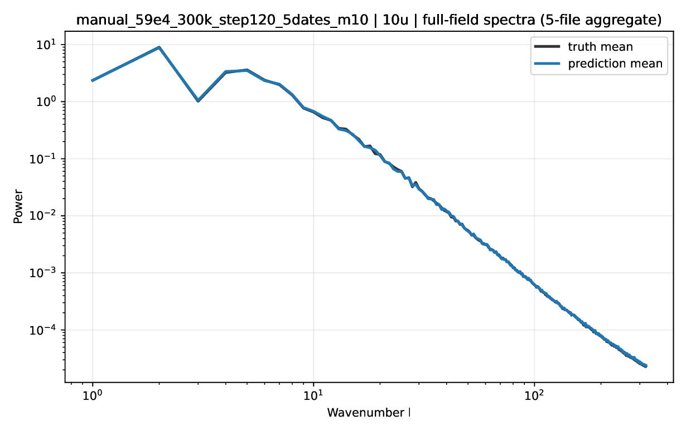
### `spectra_10v.pdf`
[`spectra_10v.pdf`](links/spectra/spectra_step120_5dates_m10/spectra_10v.pdf)
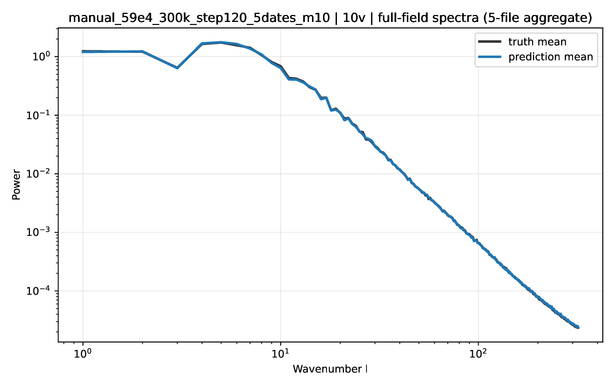
### `spectra_2t.pdf`
[`spectra_2t.pdf`](links/spectra/spectra_step120_5dates_m10/spectra_2t.pdf)
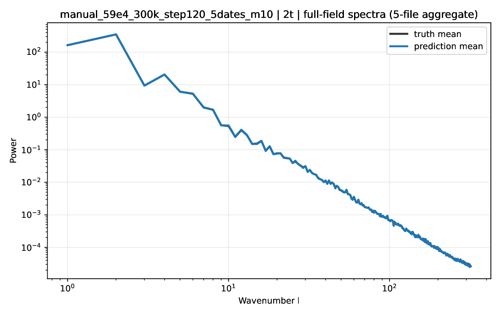
### `spectra_msl.pdf`
[`spectra_msl.pdf`](links/spectra/spectra_step120_5dates_m10/spectra_msl.pdf)
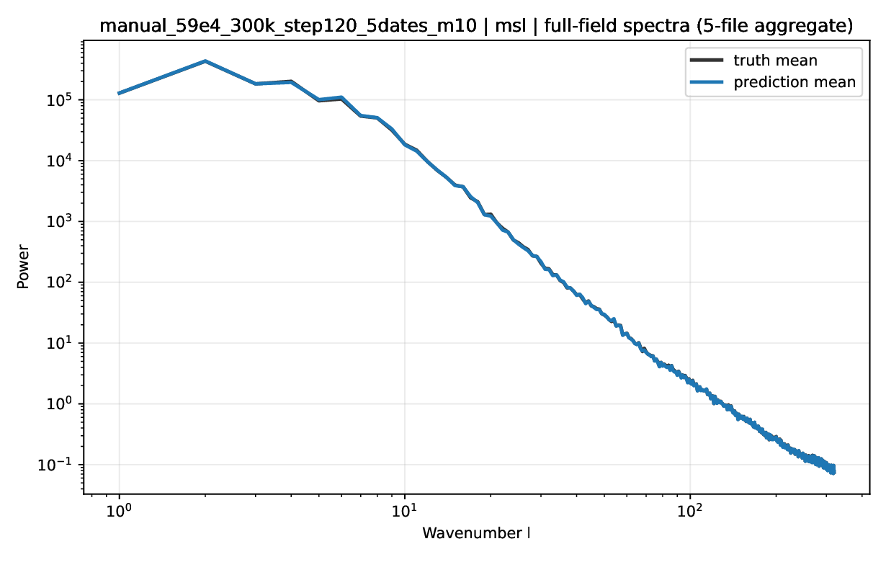
### `spectra_residual_10u.pdf`
[`spectra_residual_10u.pdf`](links/spectra/spectra_step120_5dates_m10/spectra_residual_10u.pdf)
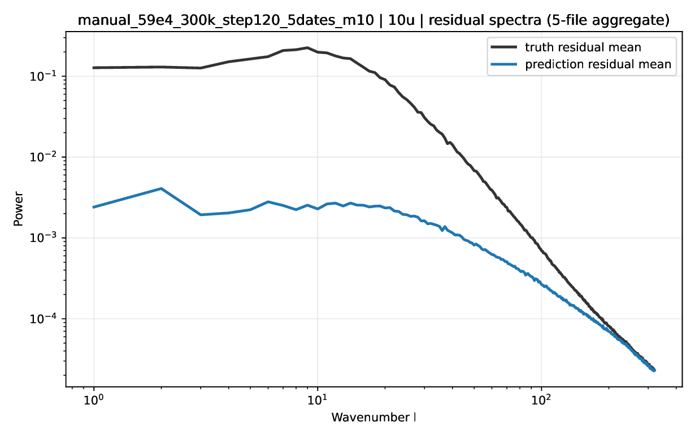
### `spectra_residual_10v.pdf`
[`spectra_residual_10v.pdf`](links/spectra/spectra_step120_5dates_m10/spectra_residual_10v.pdf)
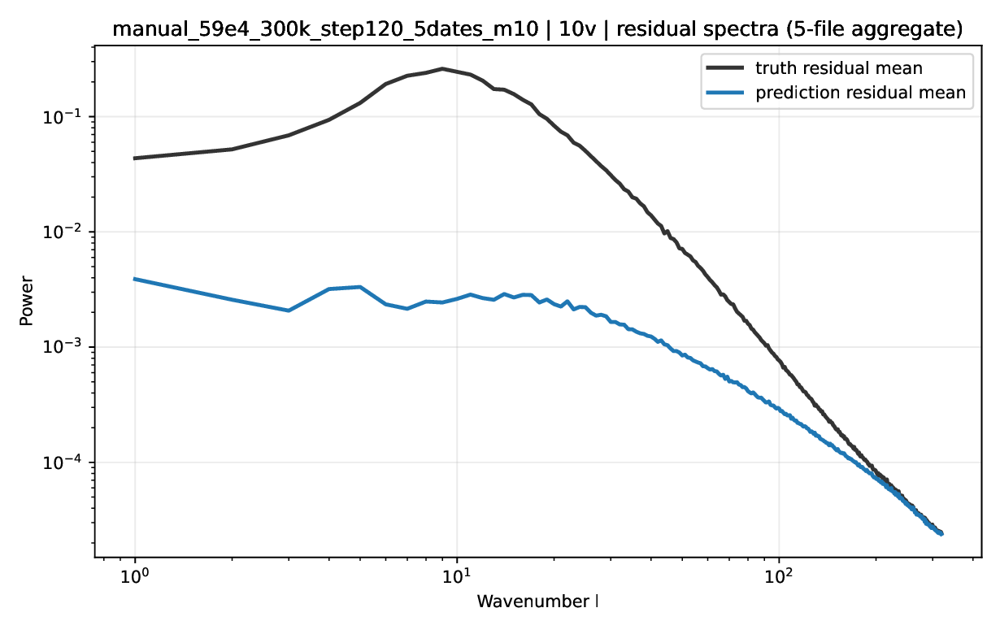
### `spectra_residual_2t.pdf`
[`spectra_residual_2t.pdf`](links/spectra/spectra_step120_5dates_m10/spectra_residual_2t.pdf)
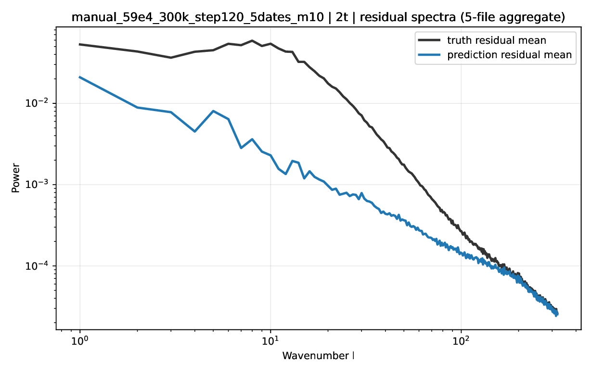
### `spectra_residual_msl.pdf`
[`spectra_residual_msl.pdf`](links/spectra/spectra_step120_5dates_m10/spectra_residual_msl.pdf)
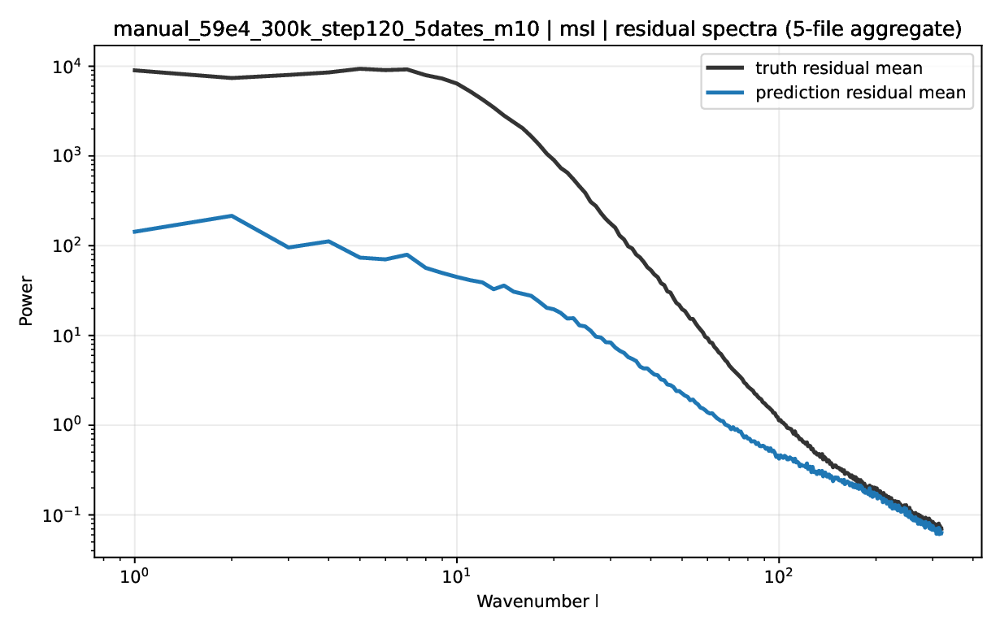
### `spectra_residual_t_850.pdf`
[`spectra_residual_t_850.pdf`](links/spectra/spectra_step120_5dates_m10/spectra_residual_t_850.pdf)
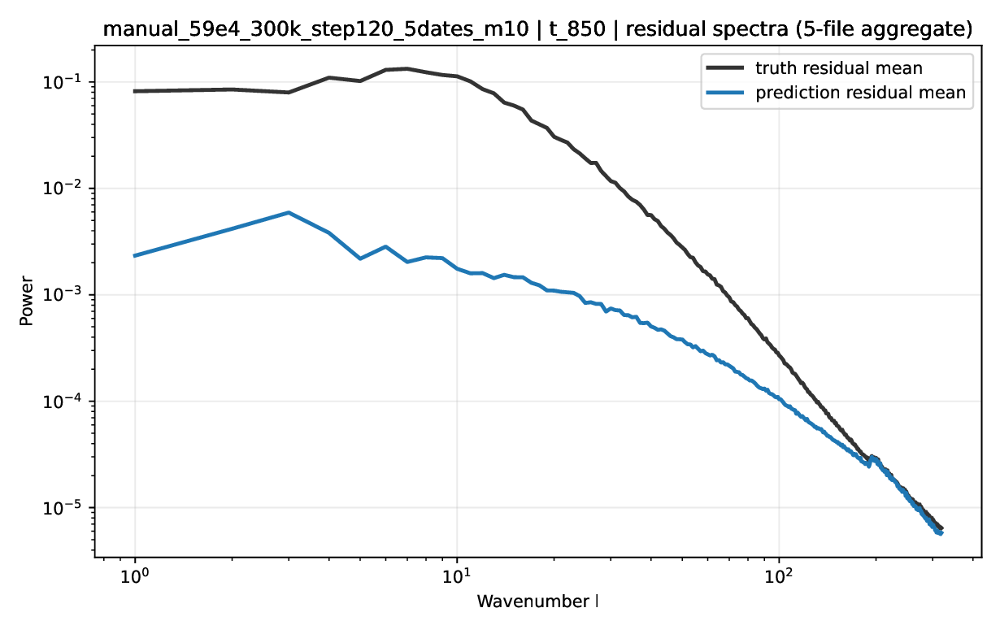
### `spectra_residual_z_500.pdf`
[`spectra_residual_z_500.pdf`](links/spectra/spectra_step120_5dates_m10/spectra_residual_z_500.pdf)
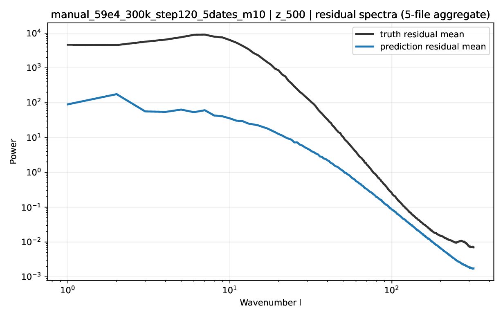
### `spectra_t_850.pdf`
[`spectra_t_850.pdf`](links/spectra/spectra_step120_5dates_m10/spectra_t_850.pdf)
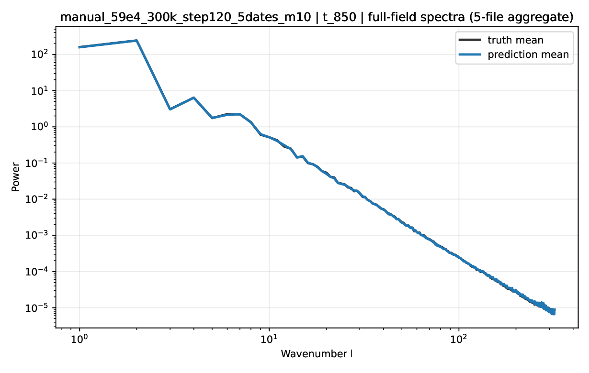
### `spectra_z_500.pdf`
[`spectra_z_500.pdf`](links/spectra/spectra_step120_5dates_m10/spectra_z_500.pdf)
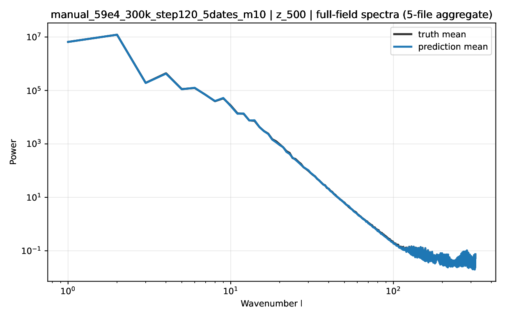
## TC PDF previews
### `tc_normed_pdfs_idalia_franklin_manual_59e4_300k_from_predictions.pdf`
[`tc_normed_pdfs_idalia_franklin_manual_59e4_300k_from_predictions.pdf`](links/artifacts/tc_normed_pdfs_idalia_franklin_manual_59e4_300k_from_predictions.pdf)
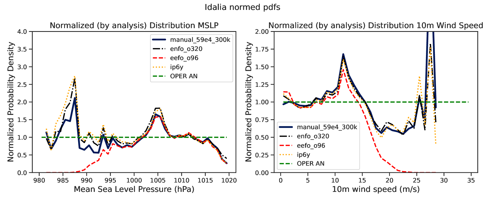
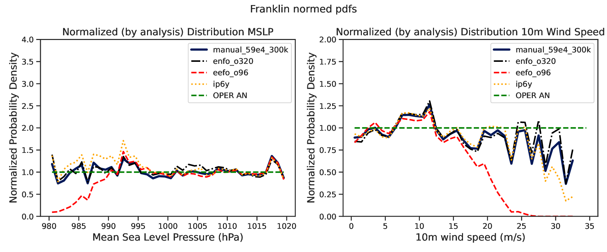

