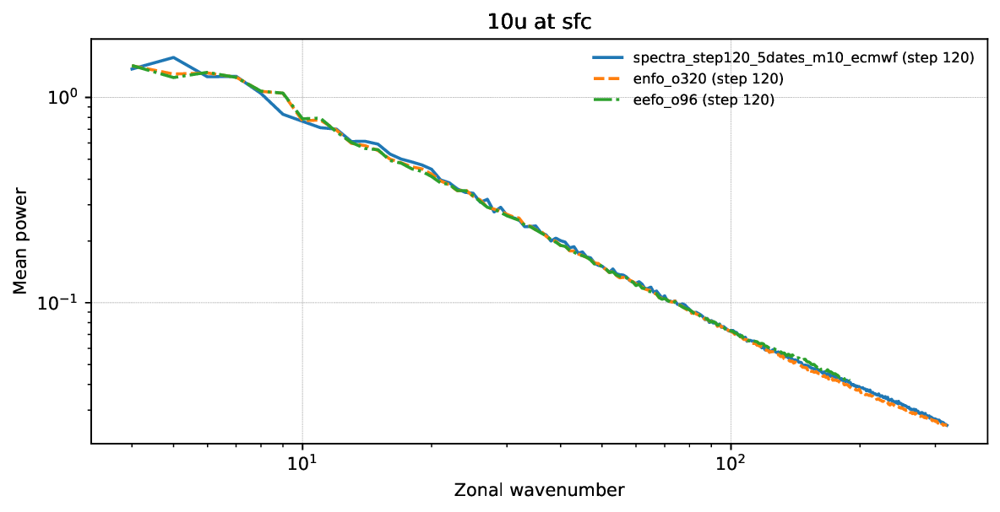
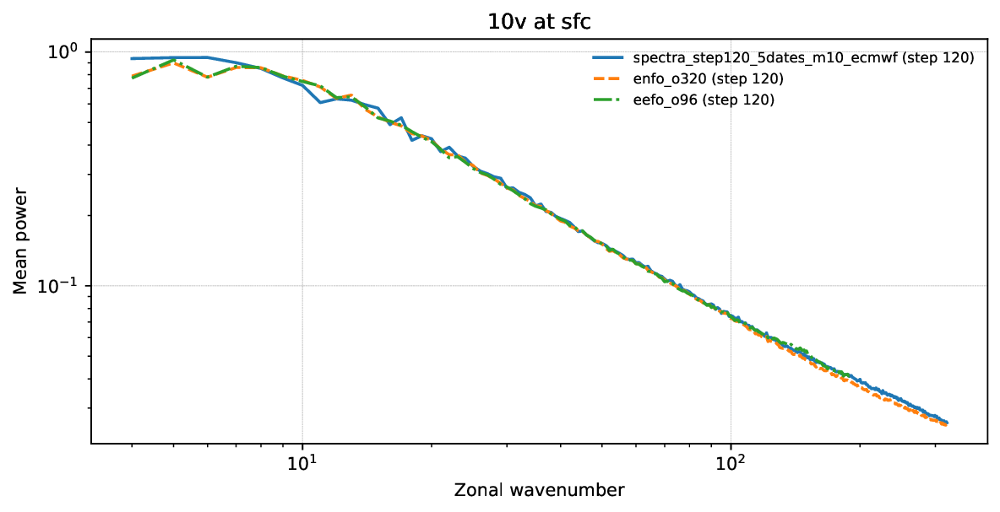
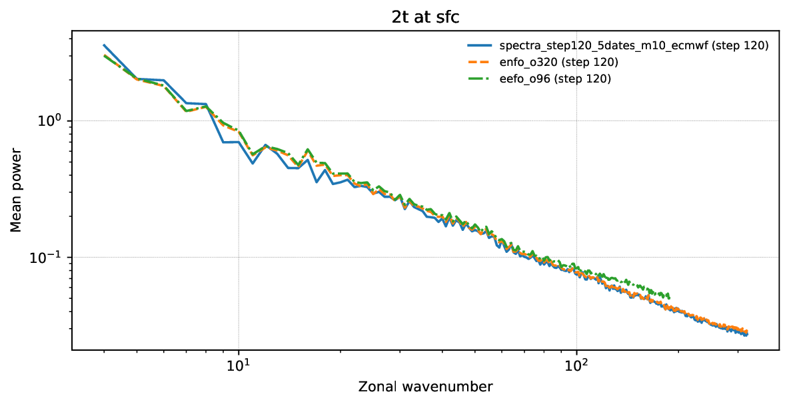
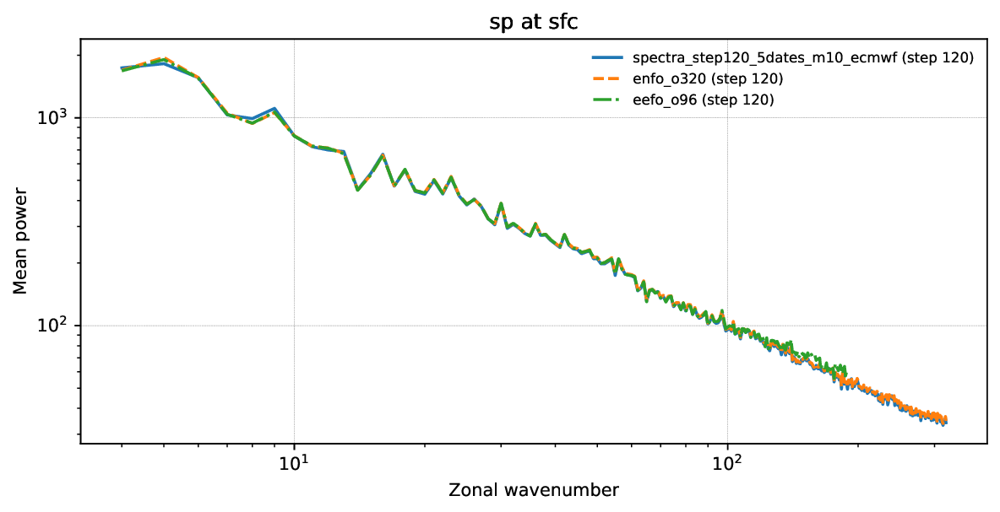
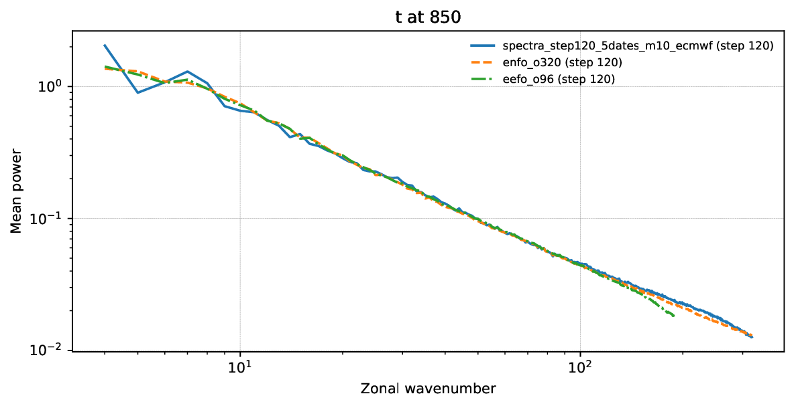
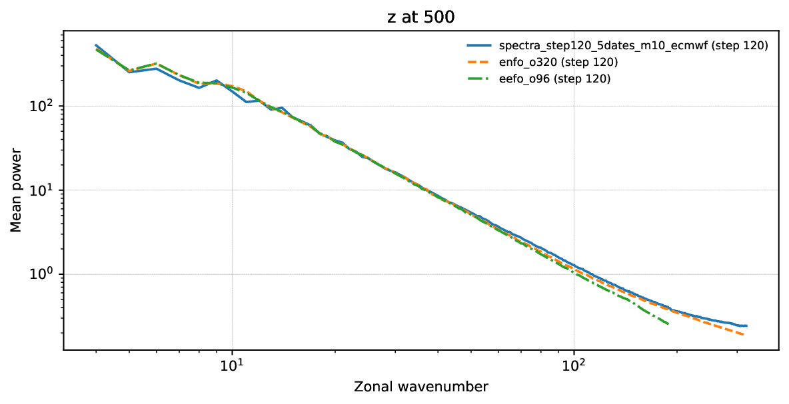
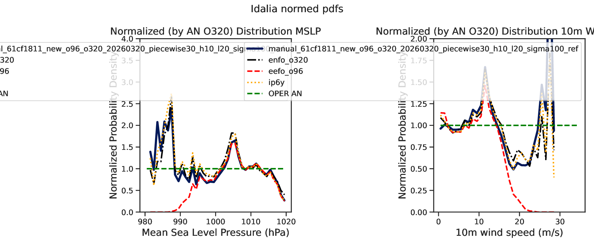
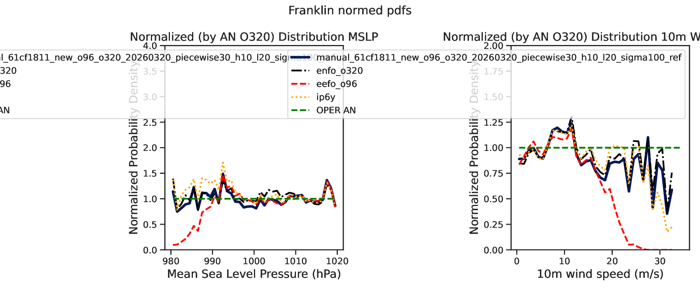

# 61cf pw30 exp/karras

Generated: `2026-03-25T19:38:39Z`

Storage root: `/home/ecm5702/hpcperm/docs/exp/manual-61cf1811-new-piecewise30-h10-l20-sigma100`

## What this is
This room mirrors the current scoreboard-facing manual-inference artifacts into an Obsidian-friendly page with inline previews plus lightweight copied configs, stats, logs, and selected artifacts inside the vault.

> GitHub note:
> the inline PNG previews render directly here; lightweight files are copied into the vault, while bulky data such as `predictions/` and plot directories remain linked so the vault stays git-light.

## Experiment identity
- slug: `manual-61cf1811-new-piecewise30-h10-l20-sigma100`
- checkpoint id: `61cf18112f9f4e5da192ae930b40aa79`
- checkpoint path: `/home/ecm5702/scratch/aifs/checkpoint/61cf18112f9f4e5da192ae930b40aa79/anemoi-by_epoch-epoch_021-step_100000.ckpt`
- stack: `new`
- run id: `manual_61cf1811_new_o96_o320_20260320_piecewise30_h10_l20_sigma100_ref`
- run root: `/home/ecm5702/perm/eval/manual_61cf1811_new_o96_o320_20260320_piecewise30_h10_l20_sigma100_ref`
- venv: `/home/ecm5702/dev/.ds-dyn/bin/activate`
- login node: `ac6-100`
- qos: `ng`
- job ids: `31418043, 31418044, 31418106`
- sampling summary: `schedule_type=experimental_piecewise, high_schedule_type=exponential, low_schedule_type=karras, num_steps=30, num_steps_high=10, num_steps_low=20, sigma_min=0.03, sigma_transition=100.0, sigma_max=100000.0, sampler=heun`
- consolidated source dossier: [`manual-61cf1811-new-piecewise30-h10-l20-sigma100.md`](links/provenance/manual-61cf1811-new-piecewise30-h10-l20-sigma100.md)

## Current scoreboard status
| surface | rank | contract | idalia tc | franklin tc | spectra mean | surface mse | val loss | note |
| --- | ---: | --- | ---: | ---: | ---: | ---: | ---: | --- |
| Aug 26-30 | 1 | `eligible` | 0.955691 | 0.700841 | 0.967218 | 10819.666366 | 0.063202 | Full contract + complete metrics. |
| Proxy10 | 7 | `eligible` | 0.716516 | 0.746305 | 0.957483 | 3990.344360 | na | Direct proxy10total row with strict regridded TC and spectra artifacts; the first post-step failed on missing `ecmwf-toolbox`, then a repair job completed the canonical bundle. |

## Coverage summary
- predictions files: `25`
- local-plot directories: `1`
- spectra directories: `1`
- top-level PDFs/PNGs: `1`
- top-level JSON/TXT/CSV/YAML files: `5`
- logs: `0`
- extra directories: `3`

## Publication notes
- full run root does not contain `EXPERIMENT_CONFIG.yaml`; room copies the dossier-recorded config at `/home/ecm5702/perm/eval/manual_61cf1811_new_o96_o320_20260320_piecewise30_h10_l20_sigma100_proxy10total/EXPERIMENT_CONFIG.yaml` instead
- no `tc_members` PNG gallery was present in the run root
- the bulky `predictions/` directory remains linked rather than copied into the vault
- files larger than `20 MB` stay linked so the vault remains lightweight

## Key data files
| file | link | size |
| --- | --- | ---: |
| `manual_inference_run_info.txt` | [`manual_inference_run_info.txt`](links/data/manual_inference_run_info.txt) | 1.3 KB |
| `predictions_manifest.csv` | [`predictions_manifest.csv`](links/data/predictions_manifest.csv) | 67.0 KB |
| `scoreboard_metrics.json` | [`scoreboard_metrics.json`](links/data/scoreboard_metrics.json) | 581 B |
| `surface_loss_summary.json` | [`surface_loss_summary.json`](links/data/surface_loss_summary.json) | 1.4 KB |
| `tc_normed_pdfs_idalia_franklin_manual_61cf1811_new_o96_o320_20260320_piecewise30_h10_l20_sigma100_ref_from_predictions.stats.json` | [`tc_normed_pdfs_idalia_franklin_manual_61cf1811_new_o96_o320_20260320_piecewise30_h10_l20_sigma100_ref_from_predictions.stats.json`](links/data/tc_normed_pdfs_idalia_franklin_manual_61cf1811_new_o96_o320_20260320_piecewise30_h10_l20_sigma100_ref_from_predictions.stats.json) | 41.1 KB |
| `predictions/` | [`predictions/`](links/data/predictions) | 25 files |

## Key top-level artifacts
| file | link | size |
| --- | --- | ---: |
| `tc_normed_pdfs_idalia_franklin_manual_61cf1811_new_o96_o320_20260320_piecewise30_h10_l20_sigma100_ref_from_predictions.pdf` | [`tc_normed_pdfs_idalia_franklin_manual_61cf1811_new_o96_o320_20260320_piecewise30_h10_l20_sigma100_ref_from_predictions.pdf`](links/artifacts/tc_normed_pdfs_idalia_franklin_manual_61cf1811_new_o96_o320_20260320_piecewise30_h10_l20_sigma100_ref_from_predictions.pdf) | 26.5 KB |

## Spectra directories
| directory | link | PNGs | PDFs |
| --- | --- | ---: | ---: |
| `spectra_step120_5dates_m10_ecmwf` | [`spectra_step120_5dates_m10_ecmwf`](links/spectra/spectra_step120_5dates_m10_ecmwf) | 0 | 6 |

## Local-plot directories
| directory | link | PNGs | PDFs |
| --- | --- | ---: | ---: |
| `eval_one_date_amazon_member01` | [`eval_one_date_amazon_member01`](links/local_plots/eval_one_date_amazon_member01) | 4 | 4 |

## Logs
No files published.

## Provenance
| file | link | size |
| --- | --- | ---: |
| `manual-61cf1811-new-piecewise30-h10-l20-sigma100.md` | [`manual-61cf1811-new-piecewise30-h10-l20-sigma100.md`](links/provenance/manual-61cf1811-new-piecewise30-h10-l20-sigma100.md) | 14.3 KB |
| `manual-61cf1811-new-piecewise30-h10-l20-sigma100.md` | [`manual-61cf1811-new-piecewise30-h10-l20-sigma100.md`](links/provenance/manual-61cf1811-new-piecewise30-h10-l20-sigma100.md) | 5.4 KB |
| `manual-61cf1811-new-piecewise30-h10-l20-sigma100.md` | [`manual-61cf1811-new-piecewise30-h10-l20-sigma100.md`](links/provenance/manual-61cf1811-new-piecewise30-h10-l20-sigma100.md) | 5.4 KB |

## Extra directories
| file | link | size |
| --- | --- | ---: |
| `eefo_o96/` | [`eefo_o96/`](links/extra/eefo_o96) | directory |
| `enfo_o320/` | [`enfo_o320/`](links/extra/enfo_o320) | directory |
| `predictions_step120_5dates/` | [`predictions_step120_5dates/`](links/extra/predictions_step120_5dates) | directory |

## Local plot gallery
### `predictions_20230826_step024` / `amazon_forest_member01_baseline.png`

### `predictions_20230826_step048` / `amazon_forest_member01_baseline.png`

### `predictions_20230826_step072` / `amazon_forest_member01_baseline.png`

### `predictions_20230826_step096` / `amazon_forest_member01_baseline.png`

## Spectra previews
### `physical_models_spectra_10u_sfc.pdf`
[`physical_models_spectra_10u_sfc.pdf`](links/spectra/spectra_step120_5dates_m10_ecmwf/physical_models_spectra_10u_sfc.pdf)

### `physical_models_spectra_10v_sfc.pdf`
[`physical_models_spectra_10v_sfc.pdf`](links/spectra/spectra_step120_5dates_m10_ecmwf/physical_models_spectra_10v_sfc.pdf)

### `physical_models_spectra_2t_sfc.pdf`
[`physical_models_spectra_2t_sfc.pdf`](links/spectra/spectra_step120_5dates_m10_ecmwf/physical_models_spectra_2t_sfc.pdf)

### `physical_models_spectra_sp_sfc.pdf`
[`physical_models_spectra_sp_sfc.pdf`](links/spectra/spectra_step120_5dates_m10_ecmwf/physical_models_spectra_sp_sfc.pdf)

### `physical_models_spectra_t_850.pdf`
[`physical_models_spectra_t_850.pdf`](links/spectra/spectra_step120_5dates_m10_ecmwf/physical_models_spectra_t_850.pdf)

### `physical_models_spectra_z_500.pdf`
[`physical_models_spectra_z_500.pdf`](links/spectra/spectra_step120_5dates_m10_ecmwf/physical_models_spectra_z_500.pdf)

## TC PDF previews
### `tc_normed_pdfs_idalia_franklin_manual_61cf1811_new_o96_o320_20260320_piecewise30_h10_l20_sigma100_ref_from_predictions.pdf`
[`tc_normed_pdfs_idalia_franklin_manual_61cf1811_new_o96_o320_20260320_piecewise30_h10_l20_sigma100_ref_from_predictions.pdf`](links/artifacts/tc_normed_pdfs_idalia_franklin_manual_61cf1811_new_o96_o320_20260320_piecewise30_h10_l20_sigma100_ref_from_predictions.pdf)

