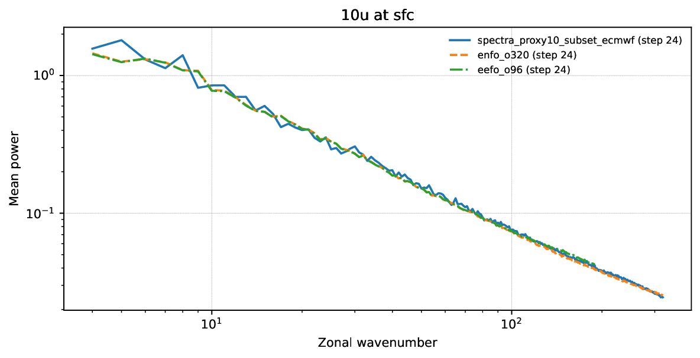
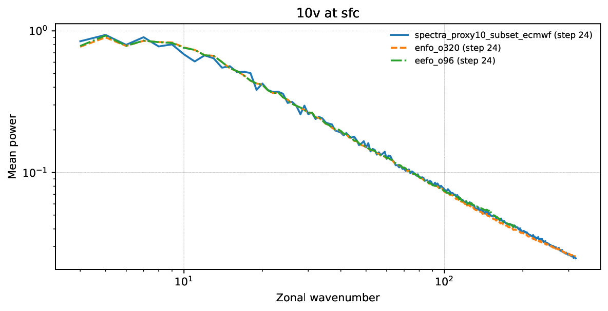
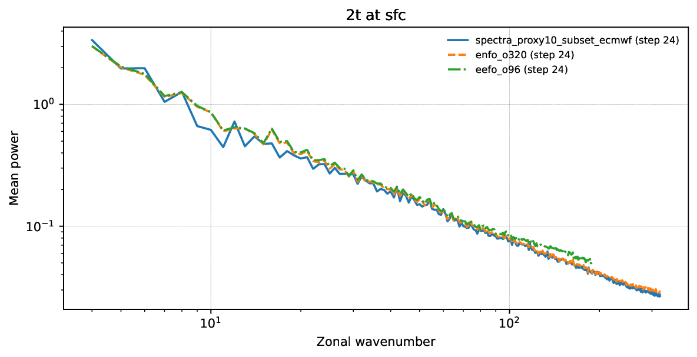
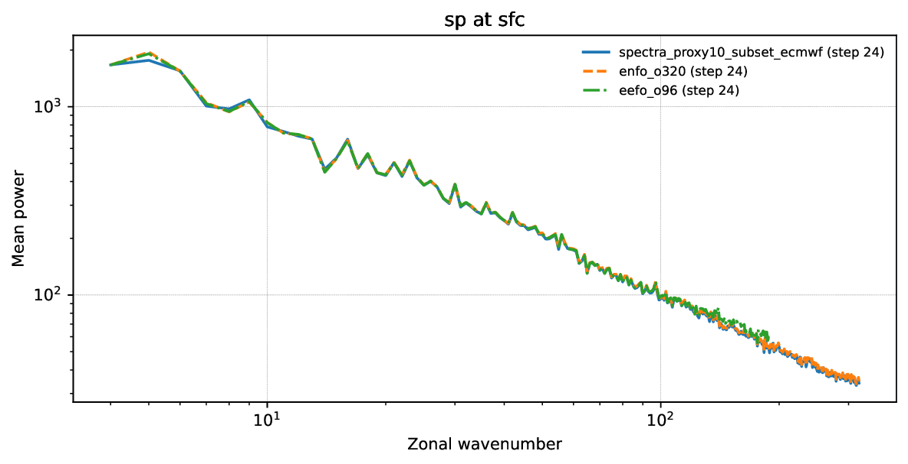
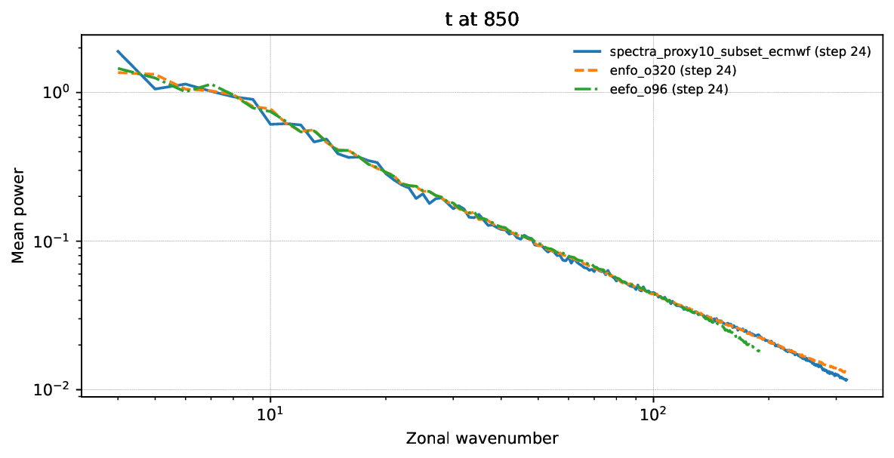
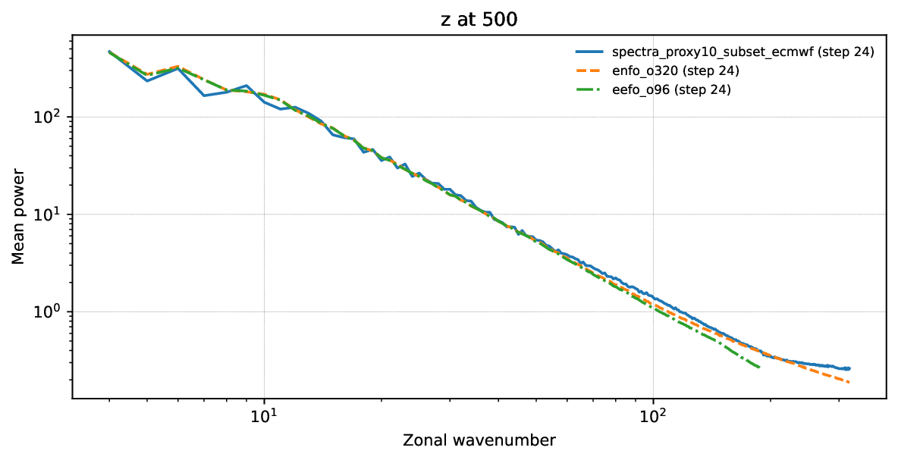
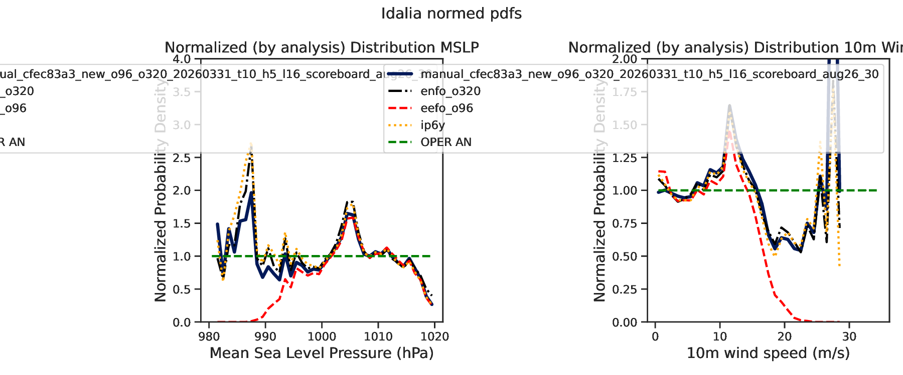
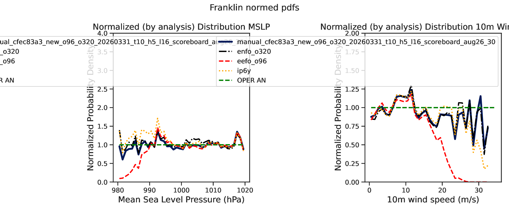

# cfec83 pw21 t10/h5/l16

Generated: `2026-04-23T14:03:22Z`

Storage root: `/home/ecm5702/hpcperm/docs/exp/manual-cfec83a3-new-piecewise21-t10-h5-l16`

## What this is
This room mirrors the current scoreboard-facing manual-inference artifacts into an Obsidian-friendly page with inline previews plus lightweight copied configs, stats, logs, and selected artifacts inside the vault.

> GitHub note:
> the inline PNG previews render directly here; lightweight files are copied into the vault, while bulky data such as `predictions/` and plot directories remain linked so the vault stays git-light.

## Experiment identity
- slug: `manual-cfec83a3-new-piecewise21-t10-h5-l16`
- checkpoint id: `cfec83a3cd0644778e2bfcbacfa9f4fc`
- checkpoint path: `/home/ecm5702/scratch/aifs/checkpoint/cfec83a3cd0644778e2bfcbacfa9f4fc/anemoi-by_epoch-epoch_043-step_200000.ckpt`
- stack: `new`
- run id: `manual_cfec83a3_new_o96_o320_20260331_t10_h5_l16_scoreboard_aug26_30`
- run root: `/home/ecm5702/perm/eval/manual_cfec83a3_new_o96_o320_20260331_t10_h5_l16_scoreboard_aug26_30`
- venv: `/home/ecm5702/dev/.ds-dyn/bin/activate`
- login node: `ac6-102`
- qos: `nf`
- job ids: `na`
- sampling summary: `schedule_type=experimental_piecewise, schedule_kind=stage1_piecewise, num_steps=21, sigma_max=1000.0, sigma_transition=10.0, sigma_min=0.03, high_schedule_type=exponential, low_schedule_type=karras, num_steps_high=5, num_steps_low=16, rho=7.0, sampler=heun, S_churn=2.5, S_min=0.75, S_max=1000.0, S_noise=1.05`
- consolidated source dossier: [`manual-cfec83a3-new-piecewise21-t10-h5-l16.md`](links/provenance/manual-cfec83a3-new-piecewise21-t10-h5-l16.md)

## Current scoreboard status
| surface | rank | contract | idalia tc | franklin tc | spectra mean | surface mse | val loss | note |
| --- | ---: | --- | ---: | ---: | ---: | ---: | ---: | --- |
| Aug 26-30 | 4 | `eligible` | 0.974236 | 0.968308 | 0.962614 | 10681.534065 | 0.066421 | Full-contract row with TC, surface-loss, sigma, and proxy10 ECMWF spectra fallback artifacts complete. |
| Proxy10 | na | `na` | na | na | na | na | na | na |

## Coverage summary
- predictions files: `25`
- local-plot directories: `0`
- spectra directories: `1`
- top-level PDFs/PNGs: `1`
- top-level JSON/TXT/CSV/YAML files: `6`
- logs: `6`
- extra directories: `3`

## Publication notes
- no local-plot directories were present at publication time
- no `tc_members` PNG gallery was present in the run root
- the bulky `predictions/` directory remains linked rather than copied into the vault
- files larger than `20 MB` stay linked so the vault remains lightweight

## Key data files
| file | link | size |
| --- | --- | ---: |
| `EXPERIMENT_CONFIG.yaml` | [`EXPERIMENT_CONFIG.yaml`](links/data/EXPERIMENT_CONFIG.yaml) | 2.2 KB |
| `manual_inference_run_info.txt` | [`manual_inference_run_info.txt`](links/data/manual_inference_run_info.txt) | 1.4 KB |
| `predictions_manifest.csv` | [`predictions_manifest.csv`](links/data/predictions_manifest.csv) | 66.5 KB |
| `scoreboard_metrics.json` | [`scoreboard_metrics.json`](links/data/scoreboard_metrics.json) | 399 B |
| `surface_loss_summary.json` | [`surface_loss_summary.json`](links/data/surface_loss_summary.json) | 1.4 KB |
| `tc_normed_pdfs_idalia_franklin_manual_cfec83a3_new_o96_o320_20260331_t10_h5_l16_scoreboard_aug26_30_from_predictions.stats.json` | [`tc_normed_pdfs_idalia_franklin_manual_cfec83a3_new_o96_o320_20260331_t10_h5_l16_scoreboard_aug26_30_from_predictions.stats.json`](links/data/tc_normed_pdfs_idalia_franklin_manual_cfec83a3_new_o96_o320_20260331_t10_h5_l16_scoreboard_aug26_30_from_predictions.stats.json) | 43.5 KB |
| `predictions/` | [`predictions/`](links/data/predictions) | 25 files |

## Key top-level artifacts
| file | link | size |
| --- | --- | ---: |
| `tc_normed_pdfs_idalia_franklin_manual_cfec83a3_new_o96_o320_20260331_t10_h5_l16_scoreboard_aug26_30_from_predictions.pdf` | [`tc_normed_pdfs_idalia_franklin_manual_cfec83a3_new_o96_o320_20260331_t10_h5_l16_scoreboard_aug26_30_from_predictions.pdf`](links/artifacts/tc_normed_pdfs_idalia_franklin_manual_cfec83a3_new_o96_o320_20260331_t10_h5_l16_scoreboard_aug26_30_from_predictions.pdf) | 26.4 KB |

## Spectra directories
| directory | link | PNGs | PDFs |
| --- | --- | ---: | ---: |
| `spectra_proxy10_subset_ecmwf` | [`spectra_proxy10_subset_ecmwf`](links/spectra/spectra_proxy10_subset_ecmwf) | 0 | 6 |

## Local-plot directories
No directories published.

## Logs
| file | link | size |
| --- | --- | ---: |
| `predict25_manual_cfec83a3_new_o96_o320_20260331_t10_h5_l16_scoreboard_aug26_30_35136099.out` | [`predict25_manual_cfec83a3_new_o96_o320_20260331_t10_h5_l16_scoreboard_aug26_30_35136099.out`](links/logs/predict25_manual_cfec83a3_new_o96_o320_20260331_t10_h5_l16_scoreboard_aug26_30_35136099.out) | 7.2 KB |
| `predict25_manual_cfec83a3_new_o96_o320_20260331_t10_h5_l16_scoreboard_aug26_30_35138694.out` | [`predict25_manual_cfec83a3_new_o96_o320_20260331_t10_h5_l16_scoreboard_aug26_30_35138694.out`](links/logs/predict25_manual_cfec83a3_new_o96_o320_20260331_t10_h5_l16_scoreboard_aug26_30_35138694.out) | 532.9 KB |
| `scoreboard_write_manual_cfec83a3_new_o96_o320_20260331_t10_h5_l16_scoreboard_aug26_30_35138696.out` | [`scoreboard_write_manual_cfec83a3_new_o96_o320_20260331_t10_h5_l16_scoreboard_aug26_30_35138696.out`](links/logs/scoreboard_write_manual_cfec83a3_new_o96_o320_20260331_t10_h5_l16_scoreboard_aug26_30_35138696.out) | 7.1 KB |
| `scoreboard_write_manual_cfec83a3_new_o96_o320_20260331_t10_h5_l16_scoreboard_aug26_30_35778564.out` | [`scoreboard_write_manual_cfec83a3_new_o96_o320_20260331_t10_h5_l16_scoreboard_aug26_30_35778564.out`](links/logs/scoreboard_write_manual_cfec83a3_new_o96_o320_20260331_t10_h5_l16_scoreboard_aug26_30_35778564.out) | 7.8 KB |
| `scoreboard_write_manual_cfec83a3_new_o96_o320_20260331_t10_h5_l16_scoreboard_aug26_30_35779201.out` | [`scoreboard_write_manual_cfec83a3_new_o96_o320_20260331_t10_h5_l16_scoreboard_aug26_30_35779201.out`](links/logs/scoreboard_write_manual_cfec83a3_new_o96_o320_20260331_t10_h5_l16_scoreboard_aug26_30_35779201.out) | 402.3 KB |
| `sigma_eval_manual_cfec83a3_new_o96_o320_20260331_t10_h5_l16_scoreboard_aug26_30_35136098.out` | [`sigma_eval_manual_cfec83a3_new_o96_o320_20260331_t10_h5_l16_scoreboard_aug26_30_35136098.out`](links/logs/sigma_eval_manual_cfec83a3_new_o96_o320_20260331_t10_h5_l16_scoreboard_aug26_30_35136098.out) | 8.9 KB |

## Provenance
| file | link | size |
| --- | --- | ---: |
| `manual-cfec83a3-new-piecewise21-t10-h5-l16.md` | [`manual-cfec83a3-new-piecewise21-t10-h5-l16.md`](links/provenance/manual-cfec83a3-new-piecewise21-t10-h5-l16.md) | 10.1 KB |
| `manual-cfec83a3-new-piecewise21-t10-h5-l16.md` | [`manual-cfec83a3-new-piecewise21-t10-h5-l16.md`](links/provenance/manual-cfec83a3-new-piecewise21-t10-h5-l16.md) | 5.4 KB |
| `20260328_o96_o320_piecewise_scheduler_search.md` | [`20260328_o96_o320_piecewise_scheduler_search.md`](links/provenance/20260328_o96_o320_piecewise_scheduler_search.md) | 28.4 KB |

## Extra directories
| file | link | size |
| --- | --- | ---: |
| `eefo_o96/` | [`eefo_o96/`](links/extra/eefo_o96) | directory |
| `enfo_o320/` | [`enfo_o320/`](links/extra/enfo_o320) | directory |
| `predictions_proxy10_subset/` | [`predictions_proxy10_subset/`](links/extra/predictions_proxy10_subset) | directory |

## Spectra previews
### `physical_models_spectra_10u_sfc.pdf`
[`physical_models_spectra_10u_sfc.pdf`](links/spectra/spectra_proxy10_subset_ecmwf/physical_models_spectra_10u_sfc.pdf)

### `physical_models_spectra_10v_sfc.pdf`
[`physical_models_spectra_10v_sfc.pdf`](links/spectra/spectra_proxy10_subset_ecmwf/physical_models_spectra_10v_sfc.pdf)

### `physical_models_spectra_2t_sfc.pdf`
[`physical_models_spectra_2t_sfc.pdf`](links/spectra/spectra_proxy10_subset_ecmwf/physical_models_spectra_2t_sfc.pdf)

### `physical_models_spectra_sp_sfc.pdf`
[`physical_models_spectra_sp_sfc.pdf`](links/spectra/spectra_proxy10_subset_ecmwf/physical_models_spectra_sp_sfc.pdf)

### `physical_models_spectra_t_850.pdf`
[`physical_models_spectra_t_850.pdf`](links/spectra/spectra_proxy10_subset_ecmwf/physical_models_spectra_t_850.pdf)

### `physical_models_spectra_z_500.pdf`
[`physical_models_spectra_z_500.pdf`](links/spectra/spectra_proxy10_subset_ecmwf/physical_models_spectra_z_500.pdf)

## TC PDF previews
### `tc_normed_pdfs_idalia_franklin_manual_cfec83a3_new_o96_o320_20260331_t10_h5_l16_scoreboard_aug26_30_from_predictions.pdf`
[`tc_normed_pdfs_idalia_franklin_manual_cfec83a3_new_o96_o320_20260331_t10_h5_l16_scoreboard_aug26_30_from_predictions.pdf`](links/artifacts/tc_normed_pdfs_idalia_franklin_manual_cfec83a3_new_o96_o320_20260331_t10_h5_l16_scoreboard_aug26_30_from_predictions.pdf)

