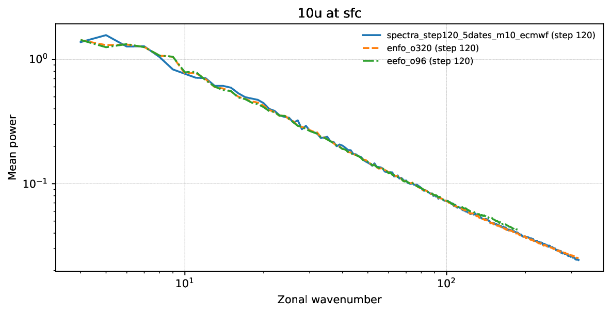
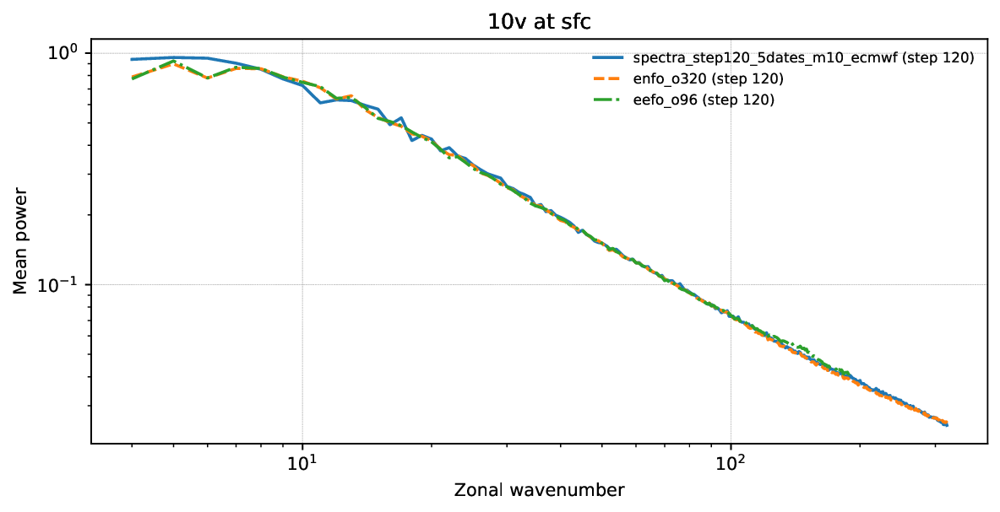
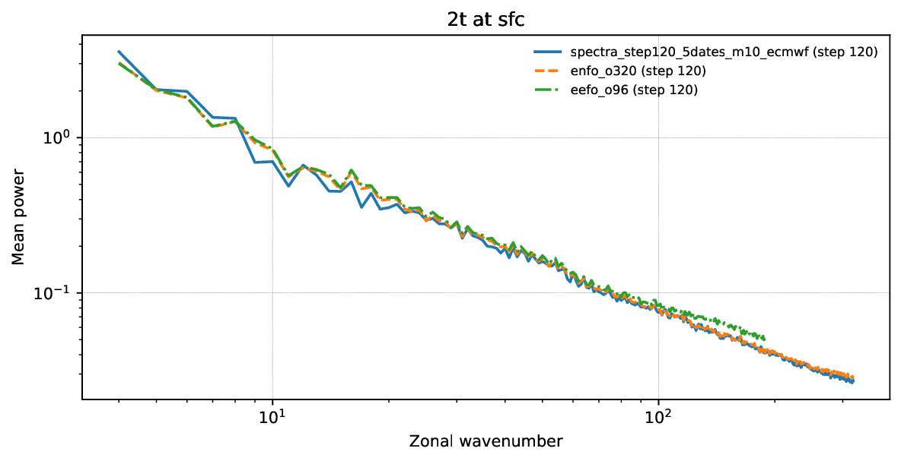
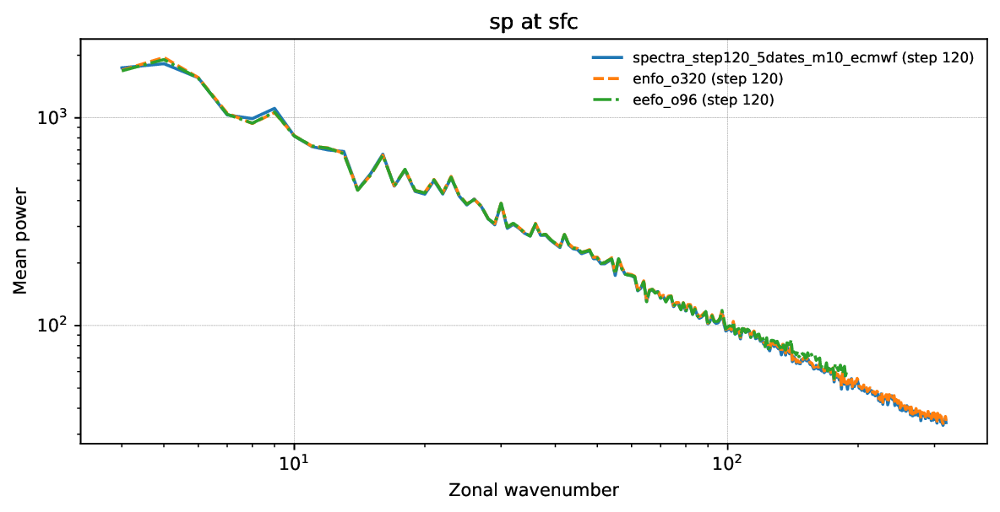
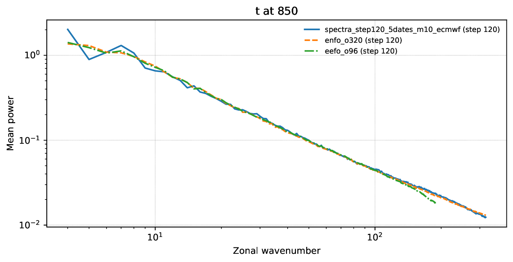
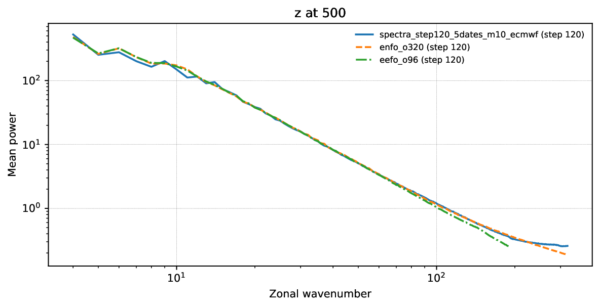
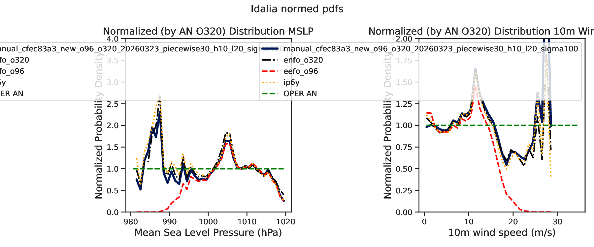
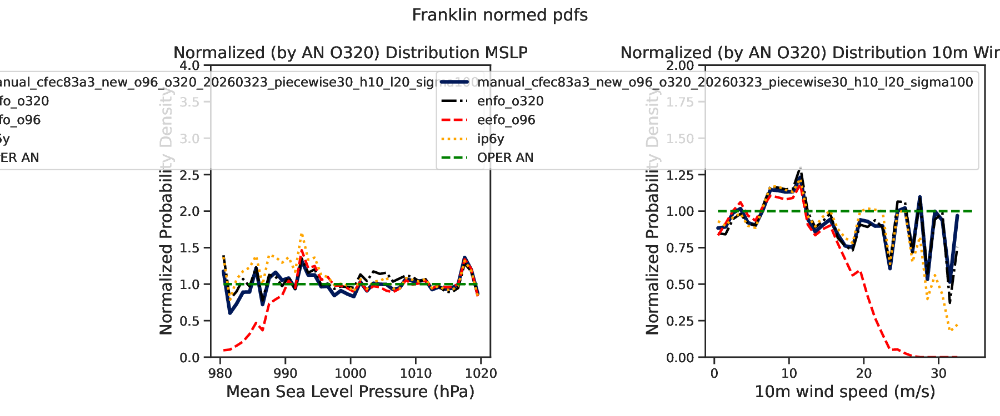

# cfec83 pw30

Generated: `2026-03-25T19:38:41Z`

Storage root: `/home/ecm5702/hpcperm/docs/exp/manual-cfec83a3-new-piecewise30-h10-l20-sigma100`

## What this is
This room mirrors the current scoreboard-facing manual-inference artifacts into an Obsidian-friendly page with inline previews plus lightweight copied configs, stats, logs, and selected artifacts inside the vault.

> GitHub note:
> the inline PNG previews render directly here; lightweight files are copied into the vault, while bulky data such as `predictions/` and plot directories remain linked so the vault stays git-light.

## Experiment identity
- slug: `manual-cfec83a3-new-piecewise30-h10-l20-sigma100`
- checkpoint id: `cfec83a3cd0644778e2bfcbacfa9f4fc`
- checkpoint path: `/home/ecm5702/scratch/aifs/checkpoint/cfec83a3cd0644778e2bfcbacfa9f4fc/last.ckpt`
- stack: `new`
- run id: `manual_cfec83a3_new_o96_o320_20260323_piecewise30_h10_l20_sigma100`
- run root: `/home/ecm5702/perm/eval/manual_cfec83a3_new_o96_o320_20260323_piecewise30_h10_l20_sigma100`
- venv: `/home/ecm5702/dev/.ds-dyn/bin/activate`
- login node: `na`
- qos: `na`
- job ids: `na`
- sampling summary: `schedule_type=experimental_piecewise, schedule_kind=piecewise30, high_schedule_type=exponential, low_schedule_type=karras, num_steps=30, num_steps_high=10, num_steps_low=20, sigma_min=0.03, sigma_transition=100.0, sigma_max=100000.0, rho=7.0, sampler=heun, S_churn=2.5, S_min=0.75, S_max=100000.0, S_noise=1.05`
- consolidated source dossier: [`manual-cfec83a3-new-piecewise30-h10-l20-sigma100.md`](links/provenance/manual-cfec83a3-new-piecewise30-h10-l20-sigma100.md)

## Current scoreboard status
| surface | rank | contract | idalia tc | franklin tc | spectra mean | surface mse | val loss | note |
| --- | ---: | --- | ---: | ---: | ---: | ---: | ---: | --- |
| Aug 26-30 | 6 | `eligible` | 0.909171 | 0.742939 | 0.979096 | 10671.348770 | 0.066417 | Full-contract row with complete scoreboard artifacts. |
| Proxy10 | 9 | `mismatch` | 0.654797 | 0.804913 | 0.968898 | 3900.165095 | na | Direct proxy10total row with strict TC and spectra artifacts. |

## Coverage summary
- predictions files: `25`
- local-plot directories: `1`
- spectra directories: `1`
- top-level PDFs/PNGs: `1`
- top-level JSON/TXT/CSV/YAML files: `6`
- logs: `0`
- extra directories: `3`

## Publication notes
- no `tc_members` PNG gallery was present in the run root
- the bulky `predictions/` directory remains linked rather than copied into the vault
- files larger than `20 MB` stay linked so the vault remains lightweight

## Key data files
| file | link | size |
| --- | --- | ---: |
| `EXPERIMENT_CONFIG.yaml` | [`EXPERIMENT_CONFIG.yaml`](links/data/EXPERIMENT_CONFIG.yaml) | 3.1 KB |
| `manual_inference_run_info.txt` | [`manual_inference_run_info.txt`](links/data/manual_inference_run_info.txt) | 1.3 KB |
| `predictions_manifest.csv` | [`predictions_manifest.csv`](links/data/predictions_manifest.csv) | 66.0 KB |
| `scoreboard_metrics.json` | [`scoreboard_metrics.json`](links/data/scoreboard_metrics.json) | 577 B |
| `surface_loss_summary.json` | [`surface_loss_summary.json`](links/data/surface_loss_summary.json) | 1.4 KB |
| `tc_normed_pdfs_idalia_franklin_manual_cfec83a3_new_o96_o320_20260323_piecewise30_h10_l20_sigma100_from_predictions.stats.json` | [`tc_normed_pdfs_idalia_franklin_manual_cfec83a3_new_o96_o320_20260323_piecewise30_h10_l20_sigma100_from_predictions.stats.json`](links/data/tc_normed_pdfs_idalia_franklin_manual_cfec83a3_new_o96_o320_20260323_piecewise30_h10_l20_sigma100_from_predictions.stats.json) | 41.1 KB |
| `predictions/` | [`predictions/`](links/data/predictions) | 25 files |

## Key top-level artifacts
| file | link | size |
| --- | --- | ---: |
| `tc_normed_pdfs_idalia_franklin_manual_cfec83a3_new_o96_o320_20260323_piecewise30_h10_l20_sigma100_from_predictions.pdf` | [`tc_normed_pdfs_idalia_franklin_manual_cfec83a3_new_o96_o320_20260323_piecewise30_h10_l20_sigma100_from_predictions.pdf`](links/artifacts/tc_normed_pdfs_idalia_franklin_manual_cfec83a3_new_o96_o320_20260323_piecewise30_h10_l20_sigma100_from_predictions.pdf) | 26.4 KB |

## Spectra directories
| directory | link | PNGs | PDFs |
| --- | --- | ---: | ---: |
| `spectra_step120_5dates_m10_ecmwf` | [`spectra_step120_5dates_m10_ecmwf`](links/spectra/spectra_step120_5dates_m10_ecmwf) | 0 | 6 |

## Local-plot directories
| directory | link | PNGs | PDFs |
| --- | --- | ---: | ---: |
| `eval_one_date_amazon_member01` | [`eval_one_date_amazon_member01`](links/local_plots/eval_one_date_amazon_member01) | 5 | 5 |

## Logs
No files published.

## Provenance
| file | link | size |
| --- | --- | ---: |
| `manual-cfec83a3-new-piecewise30-h10-l20-sigma100.md` | [`manual-cfec83a3-new-piecewise30-h10-l20-sigma100.md`](links/provenance/manual-cfec83a3-new-piecewise30-h10-l20-sigma100.md) | 14.1 KB |
| `manual-cfec83a3-new-piecewise30-h10-l20-sigma100.md` | [`manual-cfec83a3-new-piecewise30-h10-l20-sigma100.md`](links/provenance/manual-cfec83a3-new-piecewise30-h10-l20-sigma100.md) | 5.0 KB |
| `manual-cfec83a3-new-piecewise30-h10-l20-sigma100.md` | [`manual-cfec83a3-new-piecewise30-h10-l20-sigma100.md`](links/provenance/manual-cfec83a3-new-piecewise30-h10-l20-sigma100.md) | 5.0 KB |
| `20260320_recent_eval_audit.md` | [`20260320_recent_eval_audit.md`](links/provenance/20260320_recent_eval_audit.md) | 33.2 KB |

## Extra directories
| file | link | size |
| --- | --- | ---: |
| `eefo_o96/` | [`eefo_o96/`](links/extra/eefo_o96) | directory |
| `enfo_o320/` | [`enfo_o320/`](links/extra/enfo_o320) | directory |
| `predictions_step120_5dates/` | [`predictions_step120_5dates/`](links/extra/predictions_step120_5dates) | directory |

## Local plot gallery
### `predictions_20230826_step024` / `amazon_forest_central_member01_classic.png`

### `predictions_20230826_step048` / `amazon_forest_central_member01_classic.png`

### `predictions_20230826_step072` / `amazon_forest_central_member01_classic.png`

### `predictions_20230826_step096` / `amazon_forest_central_member01_classic.png`

### `predictions_20230826_step120` / `amazon_forest_central_member01_classic.png`

## Spectra previews
### `physical_models_spectra_10u_sfc.pdf`
[`physical_models_spectra_10u_sfc.pdf`](links/spectra/spectra_step120_5dates_m10_ecmwf/physical_models_spectra_10u_sfc.pdf)

### `physical_models_spectra_10v_sfc.pdf`
[`physical_models_spectra_10v_sfc.pdf`](links/spectra/spectra_step120_5dates_m10_ecmwf/physical_models_spectra_10v_sfc.pdf)

### `physical_models_spectra_2t_sfc.pdf`
[`physical_models_spectra_2t_sfc.pdf`](links/spectra/spectra_step120_5dates_m10_ecmwf/physical_models_spectra_2t_sfc.pdf)

### `physical_models_spectra_sp_sfc.pdf`
[`physical_models_spectra_sp_sfc.pdf`](links/spectra/spectra_step120_5dates_m10_ecmwf/physical_models_spectra_sp_sfc.pdf)

### `physical_models_spectra_t_850.pdf`
[`physical_models_spectra_t_850.pdf`](links/spectra/spectra_step120_5dates_m10_ecmwf/physical_models_spectra_t_850.pdf)

### `physical_models_spectra_z_500.pdf`
[`physical_models_spectra_z_500.pdf`](links/spectra/spectra_step120_5dates_m10_ecmwf/physical_models_spectra_z_500.pdf)

## TC PDF previews
### `tc_normed_pdfs_idalia_franklin_manual_cfec83a3_new_o96_o320_20260323_piecewise30_h10_l20_sigma100_from_predictions.pdf`
[`tc_normed_pdfs_idalia_franklin_manual_cfec83a3_new_o96_o320_20260323_piecewise30_h10_l20_sigma100_from_predictions.pdf`](links/artifacts/tc_normed_pdfs_idalia_franklin_manual_cfec83a3_new_o96_o320_20260323_piecewise30_h10_l20_sigma100_from_predictions.pdf)

