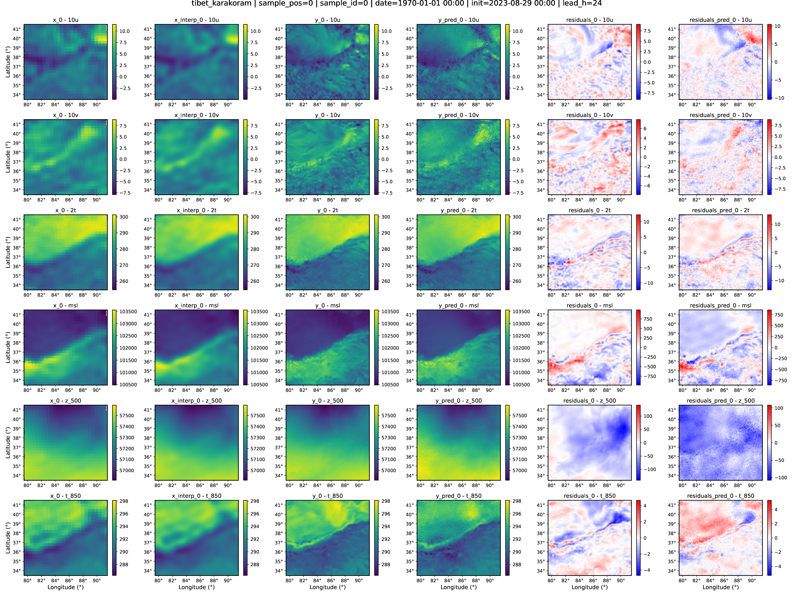
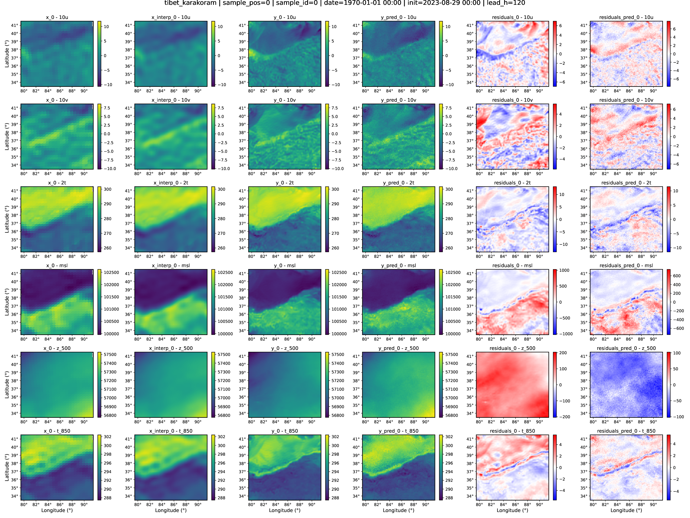
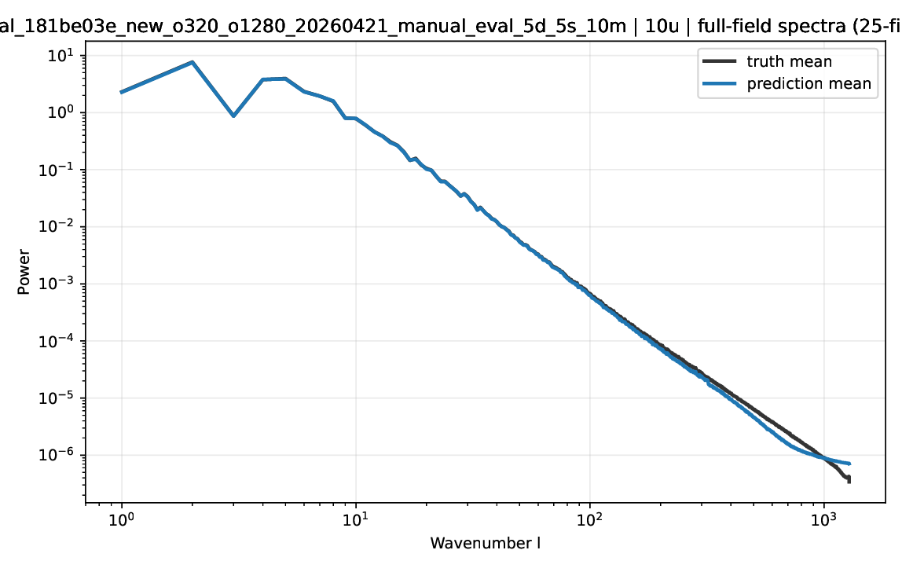
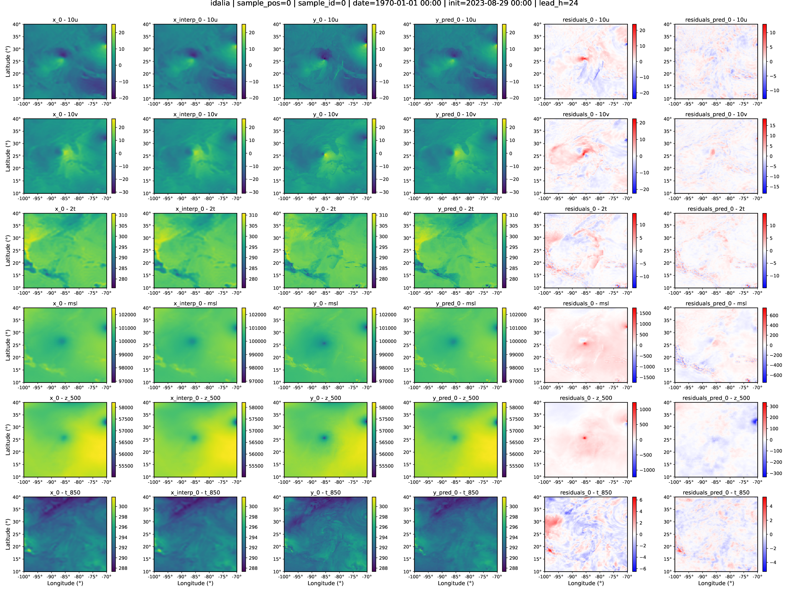
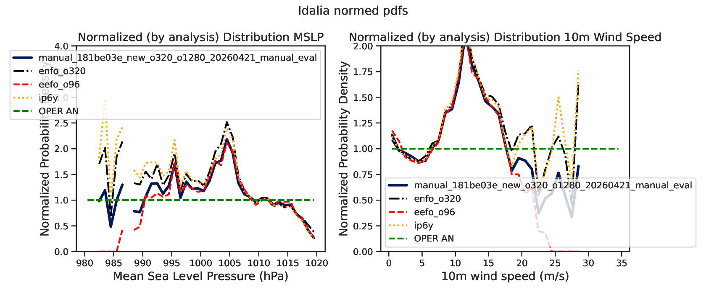
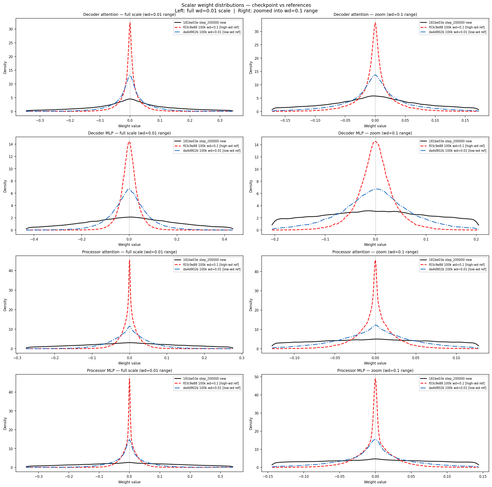
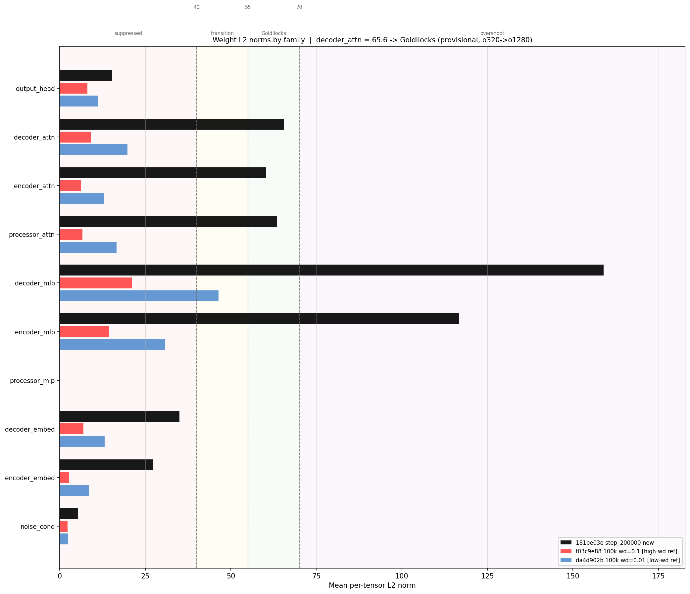

# 181be03e full25 (200k)

Status: completed
Owner: ecm5702
Last Updated (UTC): 2026-04-23
Source Links:
- `/etc/ecmwf/nfs/dh2_home_a/ecm5702/dev/docs/epics/o320_o1280/in-progress/20260421_181be03e_200k_o320_o1280_eval.md`
- `/etc/ecmwf/nfs/dh2_home_a/ecm5702/dev/docs/docs/scoreboard_o320_o1280/scoreboard.md`

## What this is
This room is the durable `o320 -> o1280` surface for the `181be03e` family at 200 000 training steps. The full25 evaluation package (predictions, local plots, spectra, TC contours, TC PDF densities, surface loss, and sigma) is complete and the run root has been finalized into the lean PDF bundle layout.

> GitHub/Obsidian note:
> files under `links/` are symlinks back to the canonical run root under `/home/ecm5702/perm/`. They are intended for local browsing on this machine.

## Identity
- checkpoint family: `181be03eed254d669c87fba5ae33931b`
- lane: `o320-o1280`
- stack: `new`
- training step: `200000`
- checkpoint root: `/home/ecm5702/scratch/aifs/checkpoint/181be03eed254d669c87fba5ae33931b`
- canonical run root: `/home/ecm5702/perm/eval/manual_181be03e_new_o320_o1280_20260421_manual_eval`
- prediction coverage: `25 / 25` files across `2023-08-26..2023-08-30`, steps `24, 48, 72, 96, 120`
- ensemble members: `10`

## Coverage snapshot
| area | status | main path |
| --- | --- | --- |
| training | `done` | `/home/ecm5702/scratch/aifs/checkpoint/181be03eed254d669c87fba5ae33931b` |
| full25 | `done` | `/home/ecm5702/perm/eval/manual_181be03e_new_o320_o1280_20260421_manual_eval` |
| sigma | `done` | `/home/ecm5702/perm/eval/scoreboards/sigma/181be03eed254d669c87fba5ae33931b_sigma_eval.csv` |
| spectra_proxy | `done` | `spectra_proxy.pdf` |
| spectra_ecmwf | `not_available` | — |
| tc_contours | `done` | `tc_contours.pdf` |
| tc_pdf_distributions | `done` | `tc_pdf_distributions.pdf` |
| local_plots_step024 | `done` | `local_plots_step024.pdf` |
| local_plots_step120 | `done` | `local_plots_step120.pdf` |
| weight_diagnostics | `done` | `weight_diagnostics/` |
| surface_loss | `done` | `surface_loss_summary.json` |
| training_loss_plots | `not_available` | no matching MLflow run |

## Lean run-root layout
```
<RUN_ROOT>/
├── EXPERIMENT_CONFIG.yaml
├── local_plots_step024.pdf
├── local_plots_step120.pdf
├── spectra_proxy.pdf
├── tc_contours.pdf
├── tc_pdf_distributions.pdf
├── weight_diagnostics/
└── data/
    ├── predictions/
    ├── predictions_manifest.csv
    ├── bundles_with_y/
    ├── spectra_proxy_5d_5s_10m/
    ├── spectra_proxy_pairs10_1m/
    ├── local_plots_regions_step024/
    ├── local_plots_regions_step120/
    ├── tc_contour_plots_step024/
    ├── tc_contour_plots_step120/
    ├── tc_local_plots_step024/
    ├── tc_local_plots_step120/
    ├── surface_loss_summary.json
    ├── o320_o1280_metrics.json
    └── ...
```

## Metrics
- `weighted_surface_mse`: 10430.98
- `weighted_surface_nmse`: 0.094
- `sigma_1_validation_loss`: 0.048230

## Preview gallery
Representative PNG previews are copied into this room for Obsidian browsing. Full PDFs remain linked from `links/artifacts/`.

### Local plots step024
[Open PDF](links/artifacts/local_plots_step024.pdf)


### Local plots step120
[Open PDF](links/artifacts/local_plots_step120.pdf)


### Spectra proxy
[Open PDF](links/artifacts/spectra_proxy.pdf)


### TC contours
[Open PDF](links/artifacts/tc_contours.pdf)


### TC PDF distributions
[Open PDF](links/artifacts/tc_pdf_distributions.pdf)


### Weight diagnostics




## Notes
- No `ip6y` reference is available for TC PDF comparison on this lane — `ip6y` is `o96 -> o320` only.
- TC contour maps show acceptable structure. Assessment: probably lacks further training rather than a fundamental architecture issue.
- Sigma eval completed via CPU fallback job `50035119`; AG-side 4-GPU retries remain useful failure evidence for launcher/model-parallel follow-up.
