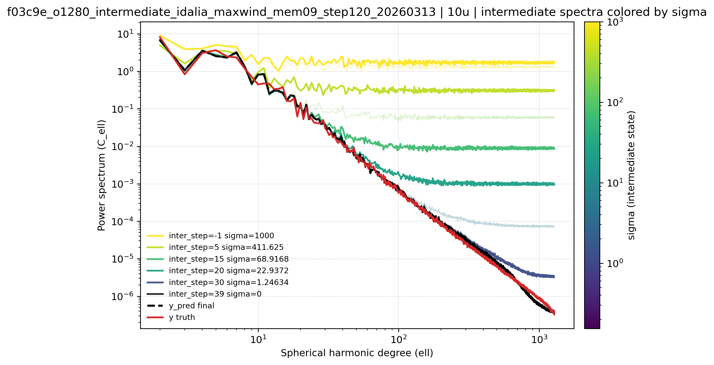

# f03c9e full25

Status: completed
Owner: ecm5702
Last Updated (UTC): 2026-03-25
Source Links:
- `/etc/ecmwf/nfs/dh2_home_a/ecm5702/dev/docs/epics/checkpoint-eval-pipeline/checkpoint-dossiers/f03c9e.md`
- `/etc/ecmwf/nfs/dh2_home_a/ecm5702/dev/docs/epics/checkpoint-eval-pipeline/completed-tasks/20260311_manual_f03c9e_100k_full25_missing_restart.md`
- `/etc/ecmwf/nfs/dh2_home_a/ecm5702/dev/docs/epics/checkpoint-eval-pipeline/completed-tasks/20260313_f03c9e_100k_tc_eval_and_maxwind_intermediate.md`

## What this is
This room is the durable `o320 -> o1280` surface for the completed `f03c9e` family. It is the safest source to use for future visualization because the full Aug 26-30 prediction set, Idalia TC diagnostics, and trusted ECMWF spectra outputs already exist.

> GitHub/Obsidian note:
> files under `links/` are symlinks back to the canonical run roots under `/home/ecm5702/perm/` and the repo docs tree. They are intended for local browsing on this machine.

## Identity
- checkpoint family: `f03c9e8862c9422f972629814d94a3a3`
- lane: `o320-o1280`
- stack: `new`
- checkpoint root: `/home/ecm5702/scratch/aifs/checkpoint/f03c9e8862c9422f972629814d94a3a3`
- canonical run root: `/home/ecm5702/perm/eval/manual_f03c9e_100k_full25_20260309_yfix1`
- prediction coverage: `25 / 25` files across `2023-08-26..2023-08-30`, steps `24, 48, 72, 96, 120`
- ensemble members: `10`
- weather states: `68`
- sampling: `{"num_steps":40,"sigma_max":1000.0,"sigma_min":0.03,"rho":7.0,"sampler":"heun","S_max":1000.0}`

## Coverage snapshot
| area | status | main path |
| --- | --- | --- |
| training | `done` | `/home/ecm5702/scratch/aifs/checkpoint/f03c9e8862c9422f972629814d94a3a3` |
| aug26_30 | `done` | `/home/ecm5702/perm/eval/manual_f03c9e_100k_full25_20260309_yfix1` |
| other_inf | `partial` | `/home/ecm5702/perm/eval/manual_f03c9e_intermediate_single_bundle_20260310` |
| tc | `done` | `/home/ecm5702/perm/eval/manual_f03c9e_100k_full25_20260309_yfix1/tc_idalia_compare_refs_regridded008deg_20260313` |
| spectra | `done` | `/home/ecm5702/perm/eval/manual_f03c9e_100k_full25_20260309_yfix1/spectra_step120_5dates_m10_ecmwf_20260313/spectra_summary.json` |
| sigma | `not-started` | `none recorded` |

## Main future-viz hooks
| artifact | link | note |
| --- | --- | --- |
| predictions directory | [`predictions/`](links/data/predictions) | final `25` prediction NetCDF files |
| predictions manifest | [`predictions_manifest.csv`](links/data/predictions_manifest.csv) | final manifest for the complete Aug 26-30 bundle |
| experiment config | [`EXPERIMENT_CONFIG.yaml`](links/data/EXPERIMENT_CONFIG.yaml) | captured run metadata and prediction inventory |
| trusted spectra summary | [`spectra_summary.json`](links/artifacts/spectra_ecmwf/spectra_summary.json) | canonical ECMWF spectra summary |
| trusted spectra PDF set | [`spectra_ecmwf/`](links/artifacts/spectra_ecmwf) | trusted PDFs for `10u`, `10v`, `2t`, `sp`, `t_850`, and `z_500` |
| Idalia TC stats | [`tc stats`](links/artifacts/tc_idalia_regridded/tc_normed_pdfs_idalia_manual_f03c9e_100k_full25_20260309_yfix1_regridded008deg_refs_eefo_o320_enfo_o1280.stats.json) | regridded Idalia comparison stats JSON |
| Idalia TC PDF | [`tc PDF`](links/artifacts/tc_idalia_regridded/tc_normed_pdfs_idalia_manual_f03c9e_100k_full25_20260309_yfix1_regridded008deg_refs_eefo_o320_enfo_o1280.pdf) | main regridded Idalia compare plot |
| intermediate plot manifest | [`intermediate_spectra_manifest.json`](links/artifacts/intermediate_idalia_maxwind/intermediate_spectra_manifest.json) | compact reusable manifest for the max-wind local-plot package |

## Gaps / caveats
- `sigma` is still missing for this family.
- `proxy10` and the `o96-o320` scoreboard contract do not apply to this lane.
- `other_inf` is only `partial`; the single-bundle intermediate package is for local inspection, not a second full inference window.

## Provenance
- checkpoint dossier: [`f03c9e.md`](links/provenance/f03c9e.md)
- restart task note: [`20260311_manual_f03c9e_100k_full25_missing_restart.md`](links/provenance/20260311_manual_f03c9e_100k_full25_missing_restart.md)
- evaluation follow-up note: [`20260313_f03c9e_100k_tc_eval_and_maxwind_intermediate.md`](links/provenance/20260313_f03c9e_100k_tc_eval_and_maxwind_intermediate.md)

## Preview gallery
Representative PNG previews are copied into this room so the vault has a quick-glance surface even before any dedicated room renderer exists.

### Idalia center intermediate baseline
[Open PDF](links/artifacts/intermediate_idalia_maxwind/idalia_center_intermediate_baseline.pdf)

### 10u center-track region style

### MSL center-track region style

### Intermediate spectra 10u
[Open PDF](links/artifacts/intermediate_idalia_maxwind/spectra_intermediate_10u.pdf)

