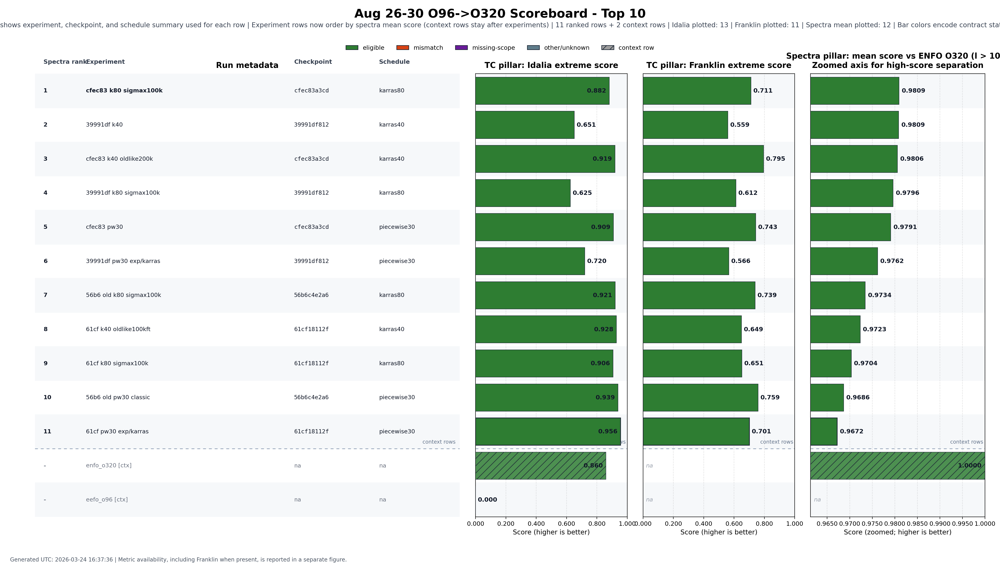
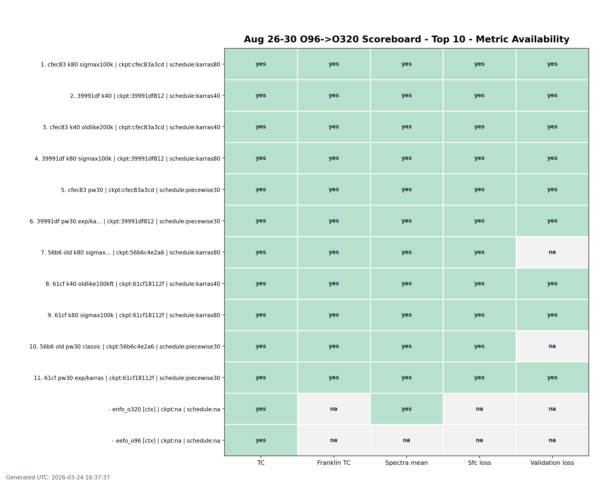
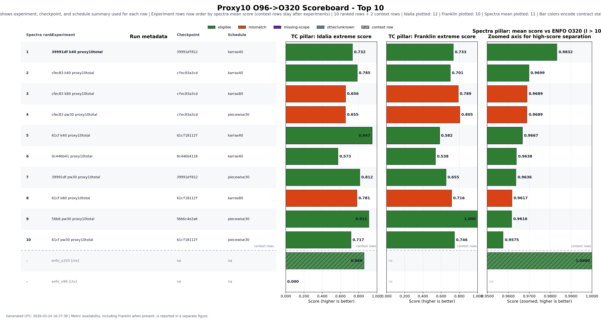
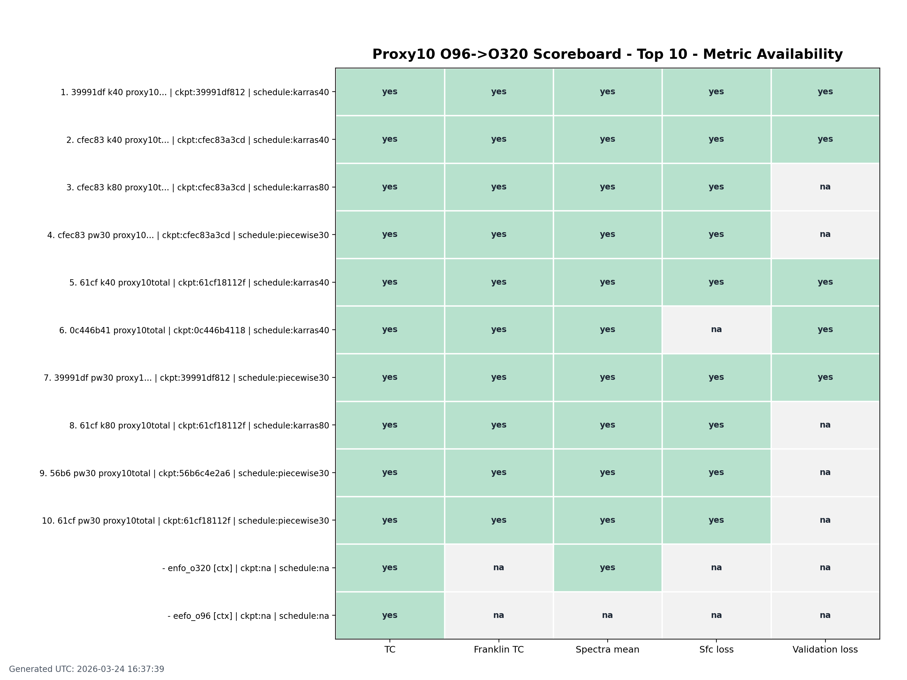

# O96->O320 current manual-scoreboard vault

Generated: `2026-03-25T19:38:41Z`

Storage root: `/home/ecm5702/hpcperm/docs/published/scoreboard_o96_o320`

## What this is
This hub mirrors the current O96->O320 scoreboard surfaces plus the top full-scoreboard manual experiments into a room-style vault layout for local Obsidian browsing.

## Publish model
- canonical hub: `/etc/ecmwf/nfs/dh2_home_a/ecm5702/dev/docs/docs/scoreboard_o96_o320`
- vault root: `/home/ecm5702/hpcperm/docs`
- published mirror: `/home/ecm5702/hpcperm/docs/published/scoreboard_o96_o320`
- selection mode: `idalia-franklin-mean`
- selection rule: current default uses the mean of Idalia and Franklin TC extreme scores

## Current scoreboards
### Aug 26-30
[`scoreboard_26_30.png`](scoreboard_26_30.png)

[`scoreboard_26_30_metrics_availability.png`](scoreboard_26_30_metrics_availability.png)

### Proxy10
[`scoreboard_proxy10.png`](scoreboard_proxy10.png)

[`scoreboard_proxy10_metrics_availability.png`](scoreboard_proxy10_metrics_availability.png)

## Published experiment rooms
| combo tc mean | full rank | proxy rank | experiment | checkpoint | schedule | idalia tc | franklin tc | spectra mean | room |
| ---: | ---: | ---: | --- | --- | --- | ---: | ---: | ---: | --- |
| 0.857141 | 5 | 4 | `cfec83 k40 oldlike200k` | `cfec83a3cd` | `karras40` | 0.919355 | 0.794926 | 0.980591 | [room](../../exp/manual-cfec83a3-new-karras40-oldlike200k/README.md) |
| 0.848680 | 2 | 2 | `56b6 old pw30 classic` | `56b6c4e2a6` | `piecewise30` | 0.938624 | 0.758736 | 0.968647 | [room](../../exp/manual-56b6c4e2-old-piecewise30-h10-l20-sigma100/README.md) |
| 0.830040 | 4 | na | `56b6 old k80 sigmax100k` | `56b6c4e2a6` | `karras80` | 0.921282 | 0.738797 | 0.973445 | [room](../../exp/manual-56b6c4e2-old-karras80-sigmax100k/README.md) |
| 0.828266 | 1 | 7 | `61cf pw30 exp/karras` | `61cf18112f` | `piecewise30` | 0.955691 | 0.700841 | 0.967218 | [room](../../exp/manual-61cf1811-new-piecewise30-h10-l20-sigma100/README.md) |
| 0.826055 | 6 | 9 | `cfec83 pw30` | `cfec83a3cd` | `piecewise30` | 0.909171 | 0.742939 | 0.979096 | [room](../../exp/manual-cfec83a3-new-piecewise30-h10-l20-sigma100/README.md) |

## Source paths
- source hub: `/etc/ecmwf/nfs/dh2_home_a/ecm5702/dev/docs/docs/scoreboard_o96_o320`
- full scoreboard csv: `/etc/ecmwf/nfs/dh2_home_a/ecm5702/dev/docs/docs/scoreboard_o96_o320/state/source_26_30/scoreboard.csv`
- proxy scoreboard csv: `/etc/ecmwf/nfs/dh2_home_a/ecm5702/dev/docs/docs/scoreboard_o96_o320/state/source_proxy10/scoreboard.csv`

## Meta files
- [`meta/selection.yaml`](meta/selection.yaml)
- [`meta/full_top_rows.csv`](meta/full_top_rows.csv)
- [`meta/proxy_selected_rows.csv`](meta/proxy_selected_rows.csv)

